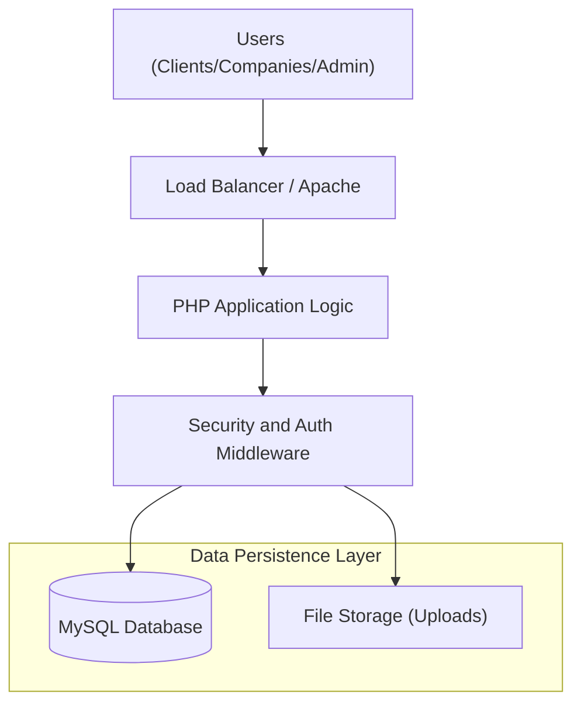
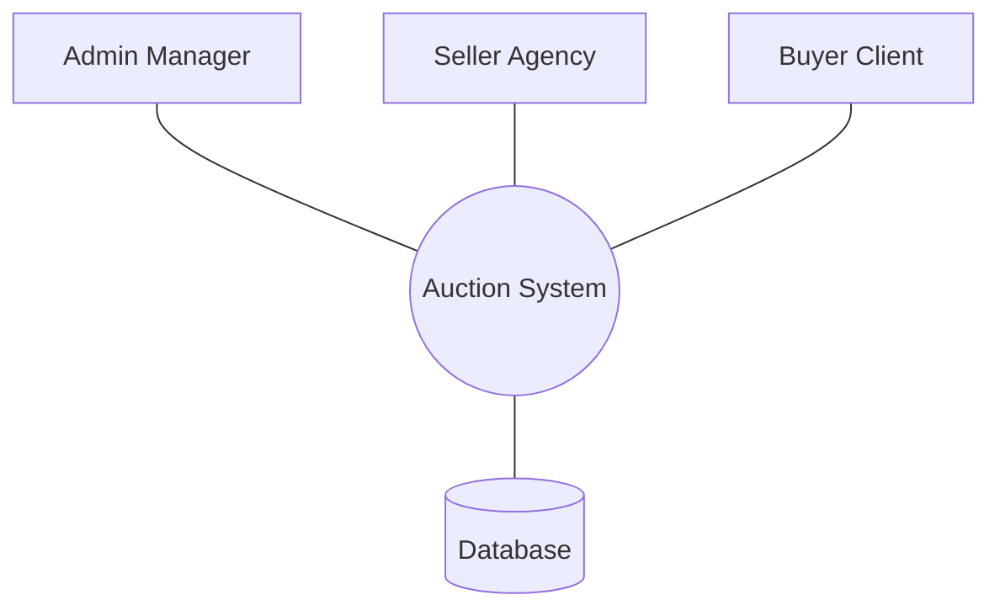
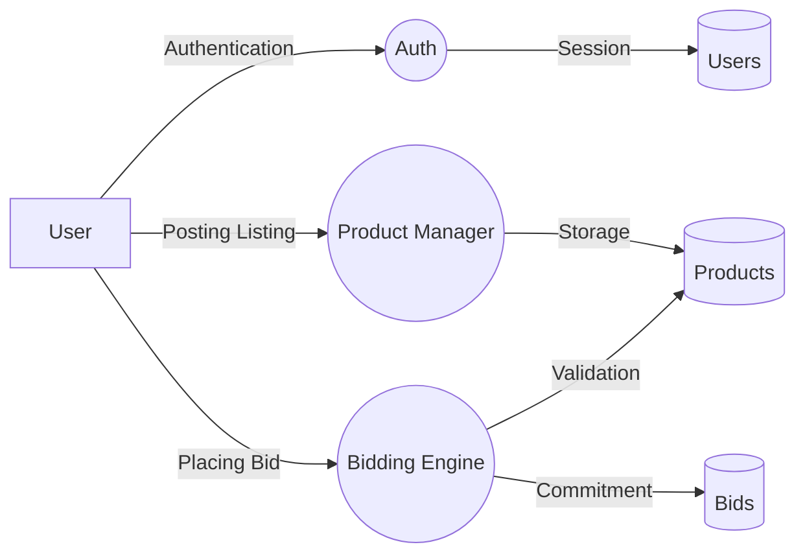
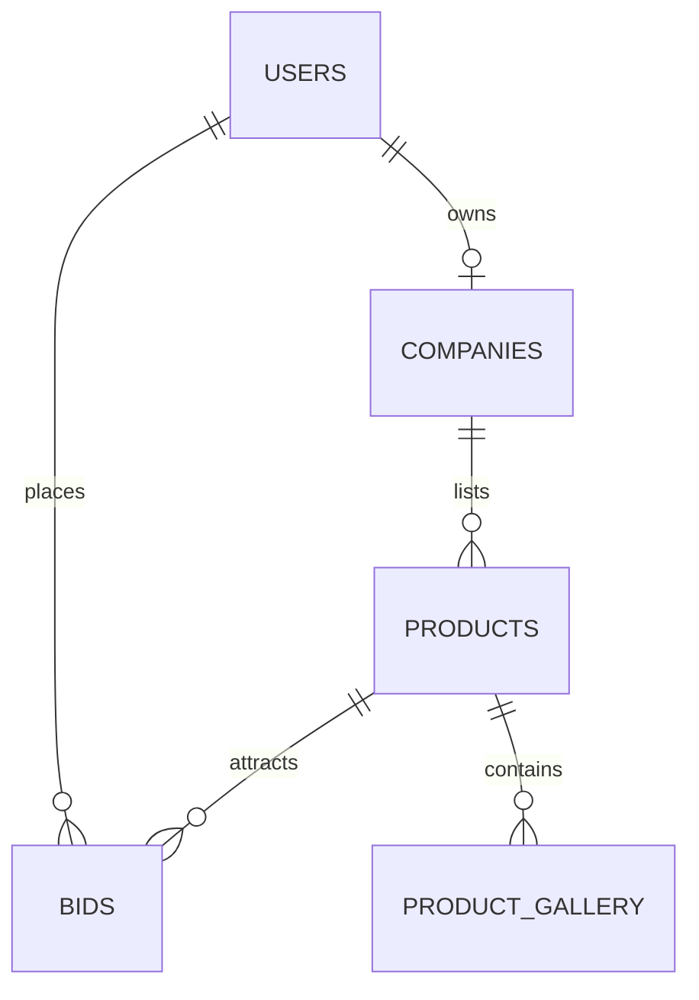

# Master Project Report: Bid For Used Product
**A Decentralized Auction and Bidding Ecosystem for Specialized Machinery and Vehicles**

---

## Abstract
The "Bid For Used Product" platform is an innovative web-based solution designed to modernize the second-hand market for vehicles and machinery in Tamil Nadu. By leveraging a role-based bidding engine and strict GST-based verification, the system eliminates traditional intermediaries, ensuring transparency and fair market pricing. This report details the full engineering lifecycle of the project, from feasibility analysis to final implementation and testing.

---

## Chapter 1: Introduction and Background

### 1.1 Detailed Motivation
The used vehicle market in regional India, specifically Tamil Nadu, is often influenced by unverified agents and a lack of price transparency. Sellers frequently lose significant margins to middlemen, while buyers face risks regarding the authenticity of the item and its ownership. The motivation for this project is to provide a "Direct-to-Buyer" (C2B/B2B) ecosystem where transparency is enforced through automated bidding logic.

### 1.2 Problem Statement
Current classified systems focus primarily on lead generation rather than transaction completion. These systems generally lack:
- Real-time competitive bidding mechanisms.
- Strict business verification logic (GST compliance).
- Specialized categories for agricultural and industrial machinery.

### 1.3 Formal System Objectives
- **Verification**: Ensure only legitimate, GST-verified businesses can list products.
- **Automation**: Automate bid status updates, auction closings, and notifications.
- **Scalability**: Design a relational database capable of handling high-concurrency bidding events.
- **Regional Focus**: Support for categories such as Tractors, JCBs, and Harvesters specific to the local economy.

### 1.4 Organizational Profile: iBOY Innovation HUB
Developed under the banner of **iBOY Innovation HUB**, led by **Jaiganesh D. (iBOY)**. The organization focuses on building AI-powered SaaS platforms and future-ready digital solutions that solve real-world industrial problems through advanced automation and backend optimization.

---

## Chapter 2: System Analysis and Feasibility

### 2.1 Multi-Dimensional Feasibility Study
#### Technical Feasibility
The system utilizes a stable PHP and MySQL stack, ensuring high compatibility with regional web hosting infrastructure. The implementation of PHP Data Objects (PDO) provides a secure layer against common vulnerabilities, while the modular architecture allows for decoupled development.

#### Operational Feasibility
User interfaces are designed with a focus on simplicity and efficiency. Sellers follow a structured listing workflow, while participants can engage in bidding through an intuitive dashboard. Administrative oversight is maintained through a dedicated verification module.

#### Economic Feasibility
By removing commission-based intermediaries, the system provides a cost-effective alternative for sellers. The platform's efficiency reduces the time-to-sale, providing better economic liquidity for machinery owners.

### 2.2 System Requirements
| Component | Minimum Requirement | Recommended |
| :--- | :--- | :--- |
| **Server OS** | Linux or Windows (XAMPP) | Cloud Linux or Ubuntu 22.04 LTS |
| **Language** | PHP 8.0 | PHP 8.2 or higher |
| **Database** | MySQL 5.7 | MariaDB 10.4 or higher |
| **Web Server** | Apache 2.4 | Apache 2.4 with Mod_Rewrite |

---

## Chapter 3: System Design and Architecture

### 3.1 System Architecture

### 3.2 Data Flow Diagrams (DFD)

#### Level 0: Context Diagram

#### Level 1: Logical DFD

### 3.3 Entity Relationship Diagram (ERD)

### 3.4 Physical Database Dictionary
| Table | Column | Data Type | Constraints | Description |
| :--- | :--- | :--- | :--- | :--- |
| **users** | `user_id` | INT | PK, AUTO_INC | Unique primary identifier for all users. |
| **users** | `role` | ENUM | NOT NULL | Defines access levels (admin, company, client). |
| **products** | `base_price` | DECIMAL | (15,2) | The starting price for the auction listing. |
| **products** | `status` | ENUM | DEFAULT 'open' | Current lifecycle state (open, closed, sold). |
| **bids** | `bid_amount` | DECIMAL | (15,2) | The financial offer made by a client. |

---

## Chapter 4: Implementation and Testing

### 4.1 Implementation Stack
The project is architected using:
- **Backend**: Native PHP with PDO for secure database interactions and modular logic.
- **Frontend**: Standards-compliant HTML5, CSS3, and Vanilla JavaScript for asynchronous operations (AJAX).
- **Security**: Password hashing via Bcrypt and input sanitization to prevent common attack vectors.

### 4.2 Detailed Testing Suite
| Test Case ID | Feature Area | Input Condition | Expected System Behavior | Result |
| :--- | :--- | :--- | :--- | :--- |
| **TC-01** | Authentication | Invalid Credentials | System denies access and logs attempt | Pass |
| **TC-02** | Bidding Logic | Bid < Current Max | System rejects bid with validation error | Pass |
| **TC-03** | Authorization | Unauthorized URL Access | Redirect to designated user dashboard | Pass |
| **TC-04** | File Handling | Large Image Upload | Resizing and secure naming in uploads | Pass |

---

## Chapter 5: Conclusion and Future Roadmap

### 5.1 Conclusion
The "Bid For Used Product" system successfully bridges the gap between traditional manual auctions and modern digital marketplaces. It provides a robust, secure, and scalable foundation for the machinery and vehicle market, specifically optimized for regional requirements.

### 5.2 Future Roadmap (Visionary)
- **Predictive Analytics**: Integration of machine learning models to forecast sale prices based on market trends and historical data.
- **Mobile Integration**: Development of native Android and iOS applications to provide low-latency push notifications.
- **Escrow Services**: Introduction of a secure gateway to hold buyer funds until physical vehicle handover is confirmed.

---

## Bibliography and Appendix
1. PHP Project Documentation Standards
2. MySQL Relational Schema Design Patterns
3. MIT Open Source License Guidelines

**Copyright 2026 iBOY Innovation HUB | Jaiganesh D.**
