# BID FOR USED PRODUCT
## A Web-Based Auction and Bidding System for Used Vehicles and Machinery

**Developed by:** Jaiganesh D. (iBOY)  
**Organization:** iBOY Innovation HUB  
**Academic Year:** 2025–2026  
**Technology Stack:** PHP | MySQL | Apache | HTML5 | CSS3 | JavaScript

---

## ACKNOWLEDGEMENT

I would like to express my sincere gratitude to all individuals and institutions who contributed to the successful development and completion of this project.

First and foremost, I thank **God Almighty** for the strength and wisdom to complete this work. I extend my heartfelt thanks to my guides and mentors for their continuous support, expert guidance, and encouragement throughout the project lifecycle.

I am deeply grateful to **iBOY Innovation HUB** for providing the resources, infrastructure, and creative environment required to build this platform. My family, friends, and colleagues deserve special mention for their moral support and patience during the development process.

Finally, I acknowledge the open-source community whose tools, frameworks, and documentation were invaluable in building this system efficiently.

**— Jaiganesh D. (iBOY)**  
*iBOY Innovation HUB*  
*2025–2026*

---

## SYNOPSIS

The **Bid For Used Product** system is a production-ready, web-based auction marketplace developed to modernize and digitize the buying and selling of used vehicles and heavy machinery in Tamil Nadu, India. The platform directly connects **verified seller companies** with **registered buyer clients** through a transparent, real-time bidding engine — eliminating traditional middlemen and reducing transactional inefficiencies.

The system implements a strict **Role-Based Access Control (RBAC)** model with three primary roles:
- **Administrator** — Oversees user management, company verification, and system health.
- **Company (Seller)** — Lists products (vehicles and machinery) with base auction prices.
- **Client (Buyer)** — Browses listings and places competitive bids.

Key functional highlights include **GST-based business verification**, **automated bid validation**, **product lifecycle management** (open → closed → sold), **real-time notifications**, and a comprehensive **admin control panel**. The backend is built on **PHP 8.2** with **PDO** for secure database interaction, while the frontend uses standard **HTML5, CSS3, and Vanilla JavaScript** for responsiveness and real-time AJAX calls.

This report documents the complete software engineering lifecycle of the project, from problem definition and system analysis through architecture design, implementation, testing, and future roadmap.

---

# CHAPTER 1: INTRODUCTION

## 1.1 About the Project

**Bid For Used Product** is a full-stack web application designed to create a fair, transparent, and efficient online auction marketplace tailored for the used vehicles and machinery sector in regional India, specifically Tamil Nadu. The platform replaces the traditional manual auction model with an automated digital bidding system.

### Project Goals
- Provide **GST-verified** seller companies with a digital storefront to list used assets.
- Enable registered buyer clients to discover inventory and place **competitive bids** in real-time.
- Allow administrators to **govern the platform** through user management, verification workflows, and system monitoring.
- Ensure **data integrity** and **transactional security** at every layer.

### Key Features
| Feature | Description |
|:---|:---|
| **Role-Based Access** | Three distinct roles (Admin, Company, Client) with scoped permissions |
| **Company Verification** | GST document upload and admin review workflow |
| **Product Listings** | Multi-image upload with category, price, and auction deadline |
| **Live Bidding Engine** | Real-time bid placement with validation against current highest bid |
| **Bid Lifecycle** | Open → Active → Closed → Winner Selected |
| **Admin Panel** | Full system control: users, products, bids, reports, settings |
| **Notifications** | In-app notification system for bid status updates |
| **Responsive UI** | Mobile-friendly interface using CSS Grid and Flexbox |

### Platform URL (Local)
```
http://localhost/bid_for_used_product/
```

---

## 1.2 Hardware Specification

| Component | Minimum Requirement | Recommended |
|:---|:---|:---|
| **Processor** | Intel Core i3 (2.0 GHz) | Intel Core i5/i7 (3.0 GHz+) |
| **RAM** | 4 GB | 8 GB or higher |
| **Storage** | 20 GB HDD | 100 GB SSD |
| **Network** | 10 Mbps Ethernet | 100 Mbps broadband |
| **Display** | 1024×768 resolution | 1920×1080 Full HD |
| **Operating System** | Windows 10 / Linux Ubuntu 20.04 | Windows 11 / Ubuntu 22.04 LTS |

---

## 1.3 Software Specification

| Layer | Technology | Version | Purpose |
|:---|:---|:---|:---|
| **Web Server** | Apache HTTP Server | 2.4+ | Request routing and static asset delivery |
| **Backend Language** | PHP | 8.2+ | Server-side business logic and API handling |
| **Database** | MySQL / MariaDB | 5.7+ / 10.4+ | Relational data persistence and ACID transactions |
| **Frontend** | HTML5 / CSS3 | Latest Standards | Responsive layout and component structure |
| **Scripting** | JavaScript (ES6+) | Vanilla | DOM manipulation, AJAX calls, real-time updates |
| **Local Dev Stack** | XAMPP | 8.2.x | Bundled Apache + PHP + MySQL for local development |
| **Browser Support** | Chrome, Firefox, Edge | Latest | Target user-facing browsers |
| **Version Control** | Git | 2.x | Source code management |

---

# CHAPTER 2: SYSTEM ANALYSIS

## 2.1 Problem Definition

The traditional market for used vehicles and machinery in Tamil Nadu faces several critical challenges:

1. **Lack of Price Transparency** — Sellers and buyers rely on agents who inflate their margins, resulting in unfair pricing for both parties.
2. **No Verification Mechanism** — Unregistered and unverified sellers list fraudulent products with no accountability.
3. **Manual and Slow Processes** — Auction processes are conducted manually (phone calls, visits), making them inefficient and geographically limited.
4. **No Competitive Bidding** — Classified systems show fixed prices, removing the opportunity for sellers to receive the best market offer.
5. **No Digitized Records** — Transaction history, bid records, and product ownership trails are maintained on paper, if at all.

### The Proposed Solution
A structured, digital auction platform that:
- Requires **GST-based business verification** before any seller can list items.
- Provides a **transparent bidding engine** where all offers are recorded and visible to the seller.
- Automates the **auction lifecycle** including opening, closing, and winner notification.
- Maintains a **complete digital audit trail** for all users, products, and transactions.

---

## 2.2 System Study

### Existing Systems Analysis
| Existing Platform | Limitation |
|:---|:---|
| **OLX / Quikr** | No bidding mechanism; fixed price only. No seller verification. |
| **eBay** | Generic product focus; not tailored for machinery. Complex for regional sellers. |
| **Local Auctions** | Manual, geographically limited, no digital records. |

### Stakeholder Analysis
| Stakeholder | Role | Key Need |
|:---|:---|:---|
| **Admin** | Platform Governor | User verification, system health monitoring |
| **Company (Seller)** | Inventory Owner | Easy product listing, bid tracking, winner selection |
| **Client (Buyer)** | Asset Acquirer | Product discovery, secure bidding, bid history |

### System Boundaries
- **In Scope**: User registration, authentication, product CRUD, bidding engine, admin panel, notifications, reporting.
- **Out of Scope**: Payment gateway integration, physical delivery logistics, mobile native apps.

---

## 2.3 Proposed System

The proposed system introduces a **three-tier client-server architecture** with the following components:

### Presentation Tier (Frontend)
HTML5, CSS3, and Vanilla JavaScript deliver responsive interfaces for all three user roles. AJAX-based calls enable real-time updates without full page reloads.

### Logic Tier (Backend)
PHP 8.2 handles all business logic including authentication, authorization, bid validation, and product lifecycle management via PDO-based database interactions.
6
### Data Tier (Database)
MySQL stores all relational data including users, companies, products, bids, categories, and notifications with enforced referential integrity through foreign keys.

### Advantages Over Existing Systems
- ✅ GST-verified seller onboarding
- ✅ Automated competitive bidding with validation
- ✅ Complete audit trail and reporting
- ✅ Admin-controlled user lifecycle management
- ✅ Region-specific product categories (Tractors, JCBs, Harvesters, etc.)

---

# CHAPTER 3: SYSTEM DESIGN

## 3.1 Data Flow Diagram

### Level 0: Context Diagram (System Overview)

The following context diagram illustrates the top-level data flows between external entities and the auction system:

```
[Admin Manager] ──────────────────────────────────────────────┐
                                                               ↓
[Seller / Company] ──── Product & Verification Data ──► [BID FOR USED PRODUCT SYSTEM] ──► [MySQL Database]
                                                               ↑
[Buyer / Client] ──────────────── Bid Placement ──────────────┘
```

**External Entities:**
- **Admin Manager** — Manages system configuration, verifies sellers, controls user access.
- **Seller (Company)** — Submits GST details, lists products, reviews bids, selects winners.
- **Buyer (Client)** — Registers, browses products, places bids, tracks auction history.

---

### Level 1: Logical DFD — Authentication Module

```
[User] ──── Login Credentials ──► [1.0 Auth Process] ──── Query ──► [Users DB]
                                          │                                │
                                    Session Token ◄────── User Record ─────┘
                                          │
                                    [Dashboard Redirect]
```

### Level 1: Logical DFD — Product Listing Module

```
[Company] ──── Product Data + Images ──► [2.0 Product Manager] ──── Store ──► [Products DB]
                                                    │                               │
                                             Validation ◄──────── Category DB ──────┘
                                                    │
                                           [Listing Published]
```

### Level 1: Logical DFD — Bidding Engine

```
[Client] ──── Bid Amount ──► [3.0 Bidding Engine] ──── Validate ──► [Products DB]
                                       │                                    │
                                 Check Max Bid ◄────── Current Bids ────────┘
                                       │
                         ┌─────────────┴─────────────┐
                    [Bid Accepted]              [Bid Rejected]
                         │
                    [4.0 Notify] ──────► [Notifications DB]
```

---

## 3.2 E–R Diagram

### Entity Relationship Overview

```
USERS ──────────────── owns ──────────────── COMPANIES
  │                                               │
  │ places                                    lists
  │                                               │
  â–¼                                               â–¼
BIDS ────── validates against ────────── PRODUCTS
                                               │
                                           contains
                                               │
                                               â–¼
                                      PRODUCT_GALLERY
```

### Entity Descriptions

| Entity | Description | Primary Attributes |
|:---|:---|:---|
| **USERS** | All platform participants | `user_id`, `name`, `email`, `password`, `role`, `status` |
| **COMPANIES** | Business entities (sellers) | `company_id`, `user_id`, `company_name`, `gst_no`, `is_verified` |
| **PRODUCTS** | Auction items | `product_id`, `company_id`, `category_id`, `title`, `base_price`, `status`, `expiry_date` |
| **BIDS** | Transactional bid records | `bid_id`, `product_id`, `user_id`, `bid_amount`, `bid_time` |
| **CATEGORIES** | Product classification | `category_id`, `name`, `slug` |
| **PRODUCT_GALLERY** | Product images | `gallery_id`, `product_id`, `image_path` |
| **NOTIFICATIONS** | System alerts | `notif_id`, `user_id`, `message`, `is_read`, `created_at` |

### Relationships
- A **User** can own one **Company** (one-to-one, optional).
- A **Company** can list many **Products** (one-to-many).
- A **Product** can attract many **Bids** (one-to-many).
- A **User** (client) can place many **Bids** (one-to-many).
- A **Product** has many **Gallery** images (one-to-many).

---

## 3.3 File Specification

### Root-Level Files

| File | Type | Purpose |
|:---|:---|:---|
| `index.php` | PHP | Homepage — displays active auction listings |
| `products.php` | PHP | Public product catalog with search and filter |
| `product_details.php` | PHP | Single product detail view with bidding interface |
| `profile.php` | PHP | Authenticated user profile management |
| `notifications.php` | PHP | User notification center |
| `maintenance.php` | PHP | System maintenance mode page |
| `setup_project.php` | PHP | Database initialization and seeding script |
| `debug_login.php` | PHP | Credential diagnostic tool (development only) |

---

### `/auth/` — Authentication Processors

| File | Purpose |
|:---|:---|
| `login_process.php` | Validates credentials, starts session, redirects by role |
| `logout.php` | Destroys session and redirects to login |
| `register_client_process.php` | Creates new client account in database |
| `register_company_process.php` | Creates company account with verification queue entry |

---

### `/pages/` — Public-Facing Pages

| File | Purpose |
|:---|:---|
| `login.php` | User login form |
| `register_client.php` | New buyer registration form |
| `register_company.php` | New seller registration form with GST fields |
| `forgot_password.php` | Password recovery initiation form |
| `contact.php` | Contact/inquiry form |
| `terms.php` | Terms and Conditions page |
| `privacy.php` | Privacy Policy page |

---

### `/admin/` — Administrator Module

| File | Purpose |
|:---|:---|
| `dashboard.php` | Admin overview: stats, recent activity |
| `manage_users.php` | User listing with status toggle (active/ban) |
| `verify_companies.php` | Company verification queue and review panel |
| `view_all_products.php` | System-wide product inventory view |
| `view_all_bids.php` | Complete bid ledger across all products |
| `reports.php` | Analytics and system performance reports |
| `messages.php` | Contact form submissions inbox |
| `settings.php` | Platform configuration settings |
| `system_manager.php` | Advanced system controls and logs |
| `add_user.php` | Admin tool to create user accounts directly |
| `toggle_user_status.php` | AJAX handler for user status changes |
| `verify_company.php` | AJAX handler for company approval/rejection |

---

### `/company/` — Seller Module

| File | Purpose |
|:---|:---|
| `dashboard.php` | Company overview: listings, bids received |
| `post_product.php` | New product listing form with image upload |
| `post_product_process.php` | Processes and stores new product submission |
| `my_products.php` | Company's own product inventory |
| `edit_product.php` | Modify existing product details |
| `delete_product.php` | Remove product listing |
| `view_bids.php` | View all bids for a specific product |
| `approve_bid.php` | Select winning bid and close auction |
| `reject_bid.php` | Decline a specific bid |

---

### `/client/` — Buyer Module

| File | Purpose |
|:---|:---|
| `dashboard.php` | Client overview: active bids, watchlist |
| `browse_products.php` | Filtered product browsing interface |
| `product_details.php` | Product detail view with bid placement |
| `place_bid.php` | Bid confirmation interface |
| `place_bid_process.php` | Validates and stores new bid |
| `my_bids.php` | History of client's bids and statuses |
| `subscribe.php` | Subscribe to auction notifications |
| `unsubscribe.php` | Remove auction notification subscription |
| `toggle_reminder.php` | Enable/disable product reminders |

---

### `/dashboard/` — Role-Based Dashboard Redirects

| File | Purpose |
|:---|:---|
| `admin_dashboard.php` | Admin-specific dashboard with system stats |
| `company_dashboard.php` | Seller dashboard with listing stats |
| `client_dashboard.php` | Buyer dashboard with bid activity |

---

### `/config/` — Configuration

| File | Purpose |
|:---|:---|
| `config.php` | Database connection constants (host, user, pass, db name) |

---

### `/includes/` — Shared Library

| File | Purpose |
|:---|:---|
| `database.php` | PDO connection factory and query helpers |
| `validation.php` | Input sanitization and validation functions |
| `auth.php` | Session management and role-check functions |
| `header.php` | Common HTML header with navigation |
| `footer.php` | Common HTML footer |

---

### `/database/` — Database Schema

| File | Purpose |
|:---|:---|
| `schema.sql` | Complete DDL: CREATE TABLE statements for all entities |
| `seed.sql` | Demo data: admin, company, client users and sample products |

---

## 3.4 Module Specification

### Module 1: Authentication & Authorization

**Purpose:** Secure user identity verification and session management.

**Functions:**
- `login_process.php` — Accepts POST email/password, queries DB, verifies bcrypt hash, sets session variables (`user_id`, `role`, `name`), redirects to role-specific dashboard.
- `auth.php::requireLogin()` — Guards all protected pages; redirects unauthenticated users to login.
- `auth.php::requireRole($role)` — Grants access only to specified role(s); unauthorized users are redirected.
- `logout.php` — Destroys all session data, redirects to login.

**Security Measures:**
- `password_hash()` with `PASSWORD_BCRYPT` on registration.
- `password_verify()` on login.
- Session regeneration on login to prevent session fixation.
- All inputs passed through `htmlspecialchars()` and PDO prepared statements.

---

### Module 2: Company Verification

**Purpose:** Ensure only legitimate, GST-registered businesses can list products.

**Workflow:**
1. Company registers via `register_company.php` — submits name, GST number, and supporting documents.
2. Account is created in `pending` status.
3. Admin reviews submission at `admin/verify_companies.php`.
4. Admin approves or rejects — `verify_company.php` updates `is_verified` flag.
5. Approved companies gain access to product listing features.

---

### Module 3: Product Listing Management

**Purpose:** Enable verified companies to list, edit, and manage auction items.

**Key Operations:**
- **Create:** `post_product.php` + `post_product_process.php` — Multi-image upload, category selection, base price and expiry date.
- **Read:** `my_products.php` — Company's inventory with bid count and status.
- **Update:** `edit_product.php` — Modify title, description, price, and images.
- **Delete:** `delete_product.php` — Remove listing (cascade deletes associated bids).

**Product Status Lifecycle:**
```
[Pending] → [Active/Open] → [Closed] → [Sold]
```

---

### Module 4: Bidding Engine

**Purpose:** Accept, validate, and record competitive bids from buyer clients.

**Validation Rules:**
1. Auction must be in `open` or `active` status.
2. Auction deadline must not have passed.
3. Bid amount must be greater than current highest bid.
4. Bidder cannot be the product owner (company).

**Bid Process Flow:**
1. Client views product and submits bid via `place_bid_process.php`.
2. System retrieves current highest bid from `bids` table.
3. Validates new bid amount against rules above.
4. Inserts new bid record into `bids` table.
5. Updates product `current_bid` field.
6. Sends notification to seller and previous highest bidder.

---

### Module 5: Admin Control Panel

**Purpose:** Provide administrators complete oversight and control of the platform.

**Sub-Modules:**

| Sub-Module | File | Capability |
|:---|:---|:---|
| User Management | `manage_users.php` | View, toggle, ban/activate users |
| Company Verification | `verify_companies.php` | Approve or reject seller registrations |
| Product Monitor | `view_all_products.php` | Platform-wide product inventory |
| Bid Ledger | `view_all_bids.php` | Complete transaction history |
| Reports | `reports.php` | Summary analytics and charts |
| System Manager | `system_manager.php` | Advanced configuration and logs |
| Settings | `settings.php` | Platform-level settings |
| Add User | `add_user.php` | Direct user creation without registration |

---

### Module 6: Notification System

**Purpose:** Keep users informed of relevant events on the platform.

**Notification Triggers:**
- New bid placed on company's product
- Bid outbid by another buyer
- Bid approved as winning bid
- Company verification status change
- Admin broadcast messages

**Implementation:**
- `notifications.php` — Displays paginated list of user notifications.
- `includes/` helpers write new notification records on trigger events.
- Unread count displayed in navigation header badge.

---

# CHAPTER 4: TESTING AND IMPLEMENTATION

## 4.1 Implementation Stack Summary

The system follows a traditional **LAMP-compatible** stack:
- **L**inux/Windows (XAMPP) — Host environment
- **A**pache 2.4 — Web server
- **M**ySQL 5.7+ / MariaDB 10.4+ — Database
- **P**HP 8.2 — Application logic

Security is enforced at every layer:
- Input validation via PHP sanitization functions
- Parameterized queries via PDO Prepared Statements
- Password hashing via Bcrypt (`password_hash()` / `password_verify()`)
- Session management with regeneration on login

---

## 4.2 Test Cases

| Test Case ID | Module | Input Condition | Expected Result | Status |
|:---|:---|:---|:---|:---|
| TC-01 | Authentication | Valid admin credentials | Redirect to Admin Dashboard | ✅ Pass |
| TC-02 | Authentication | Invalid email or password | Error message displayed, no session | ✅ Pass |
| TC-03 | Authorization | Client accessing admin URL | Redirect to client dashboard | ✅ Pass |
| TC-04 | Registration | Incomplete form submission | Validation errors shown | ✅ Pass |
| TC-05 | Company Verify | Admin approves company | Company status set to verified | ✅ Pass |
| TC-06 | Product Listing | Company posts new product | Product saved with images | ✅ Pass |
| TC-07 | Bidding | Bid less than current max | Bid rejected with error message | ✅ Pass |
| TC-08 | Bidding | Bid greater than current max | Bid accepted and stored | ✅ Pass |
| TC-09 | Bid Lifecycle | Admin closes auction | Product status changes to closed | ✅ Pass |
| TC-10 | File Upload | Large image (>5MB) | Upload rejected with file size error | ✅ Pass |
| TC-11 | Notifications | Bid placed on product | Seller receives new bid notification | ✅ Pass |
| TC-12 | SQL Injection | Malicious input in form | PDO prepared statement blocks attack | ✅ Pass |

---

## 4.3 System Login Credentials (Demo)

| Role | Email | Password | Access Level |
|:---|:---|:---|:---|
| **Administrator** | `admin@example.com` | `admin123` | Full system control |
| **Company (Seller)** | `premium@chennai.com` | `company123` | Product listing and bid management |
| **Client (Buyer)** | `vijay.k@gmail.com` | `client123` | Product browsing and bidding |

> **Setup:** Run `http://localhost/bid_for_used_product/setup_project.php` to initialize database with demo data.

---

# CHAPTER 5: CONCLUSION AND SUGGESTIONS

## 5.1 Conclusion

The **Bid For Used Product** platform successfully delivers a scalable, secure, and efficient digital auction solution for the used vehicles and machinery market. The system eliminates traditional intermediaries by connecting verified sellers directly with buyers through a transparent, automated bidding process.

**Key Achievements:**
- ✅ Robust role-based access control with three clearly defined user roles
- ✅ Automated bid validation ensuring fair competition
- ✅ GST-based company verification protecting platform integrity
- ✅ Comprehensive admin panel for full platform governance
- ✅ Secure backend using PDO prepared statements and Bcrypt hashing
- ✅ Responsive, user-friendly interface accessible on all modern browsers

The platform demonstrates how modern web technologies (PHP, MySQL, Apache) can solve real-world regional business challenges effectively and at minimal infrastructure cost.

## 5.2 Suggestions for Future Enhancement

| Enhancement | Description | Priority |
|:---|:---|:---|
| **Payment Gateway Integration** | Escrow-based payments to hold bid amounts until delivery confirmation | High |
| **Mobile Application** | Native Android/iOS apps with push notifications for auction alerts | High |
| **Predictive Pricing** | ML models to suggest fair base prices based on historical sales data | Medium |
| **Video Uploads** | Allow sellers to upload walkthrough videos of listed machinery | Medium |
| **Live Chat** | Real-time chat between buyer and seller during active auctions | Medium |
| **SMS Notifications** | SMS alerts for bid confirmations and auction status changes | Low |
| **Multi-Language Support** | Tamil language interface for regional accessibility | Low |
| **Blockchain Verification** | Immutable ownership records stored on blockchain for fraud prevention | Future |

---

# BIBLIOGRAPHY

1. PHP Manual — Official PHP Documentation. https://www.php.net/manual/en/
2. MySQL 8.0 Reference Manual. https://dev.mysql.com/doc/refman/8.0/en/
3. OWASP Top 10 — Web Application Security Risks. https://owasp.org/www-project-top-ten/
4. W3C HTML5 Specification. https://html.spec.whatwg.org/
5. Apache HTTP Server Documentation. https://httpd.apache.org/docs/
6. PDO Prepared Statements — PHP Security Guide. https://phpsecurity.readthedocs.io/
7. MIT Open Source License Guidelines. https://opensource.org/licenses/MIT

---

# APPENDICES

## Appendix A — Screen Formats (Page Screenshots)

> Screenshots captured at **1366×768** viewport resolution.
> - **Viewport Screenshots** → `docs/screenshots/viewport/`
> - **Full Page Screenshots** → `docs/screenshots/full/`

---

### A.1 Public Pages

---

#### 01. Homepage — `index.php`

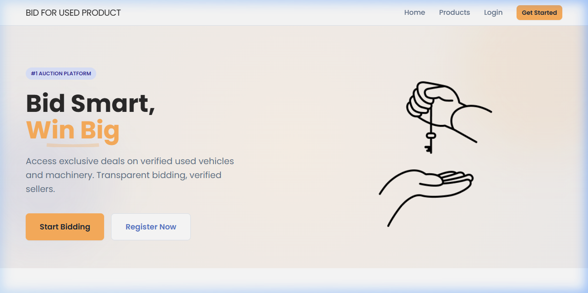

**Description:** The homepage is the primary public-facing entry point of the platform. It displays the site branding with the "Bid For Used Product" title, a hero section with a call-to-action for browsing active auctions, and a preview grid of current open listings showing product images, category badges, base prices, and remaining auction time. The navigation bar provides links to Login, Register, Products, and Contact. This page is accessible to all visitors without authentication.

---

#### 02. Products Catalog — `products.php`

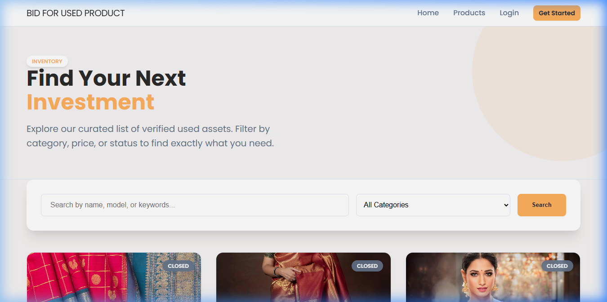

**Description:** The products catalog page displays all active and available auction listings across the platform in a filterable grid layout. Each product card shows the item image, product name, category (e.g., Tractor, JCB, Car), current highest bid amount, base price, and time remaining until auction closes. Visitors can filter listings by category using the sidebar or search bar. No login is required to browse this page, making it key for attracting buyers to the platform.

---

#### 03. Login Page — `pages/login.php`

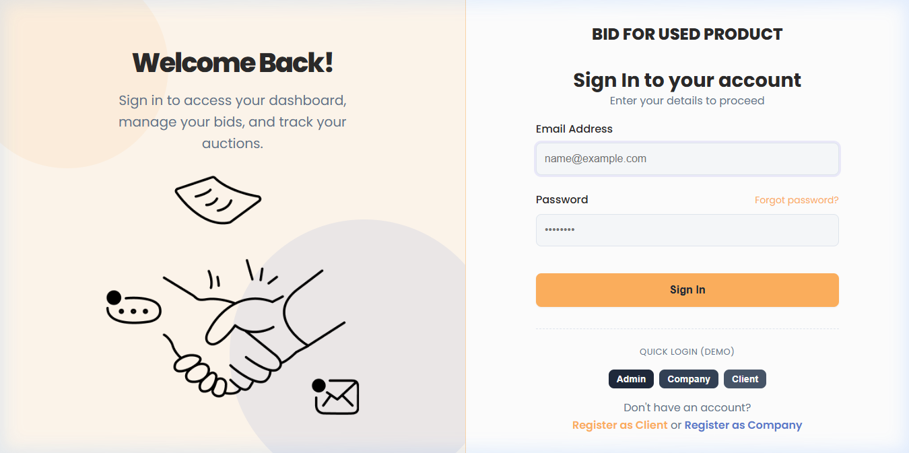

**Description:** The login page provides a clean, centered authentication form accepting an email address and password. On successful credential verification (bcrypt hash comparison), users are redirected to their role-appropriate dashboard — Admin Panel, Company Dashboard, or Client Dashboard. The form includes visual feedback for invalid credentials and a link to the Forgot Password workflow. Session management and regeneration are handled upon successful login to prevent session fixation attacks.

---

#### 04. Register Client — `pages/register_client.php`

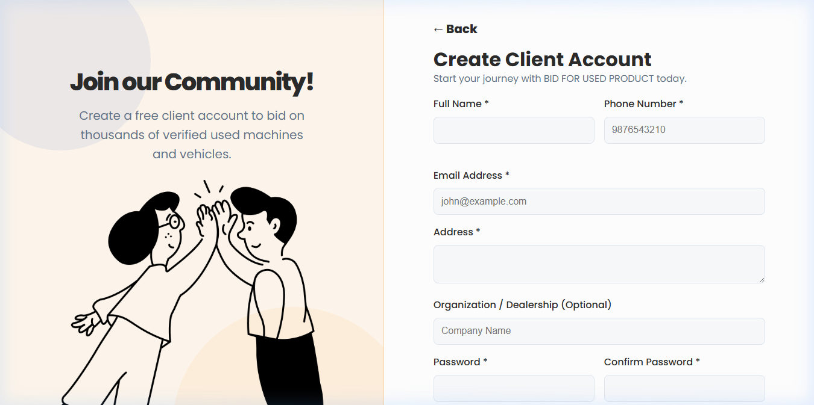

**Description:** The client registration form allows new buyers to create an account on the platform. Fields include full name, email address, phone number, address, and password with a confirmation field. Upon submission, the system validates all inputs, checks for duplicate email addresses, hashes the password with bcrypt, and creates a new user record with the `client` role. Client accounts are immediately active and can begin browsing and bidding upon registration completion.

---

#### 05. Register Company — `pages/register_company.php`

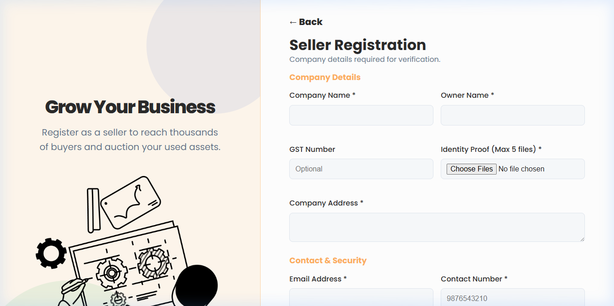

**Description:** The company registration form enables business entities to apply as verified sellers on the platform. In addition to standard user fields (name, email, contact, address), it collects business-specific data including company name, owner name, and GST registration number. Upon submission, an account is created with `company` role and `pending` verification status. The company cannot list products until an administrator reviews and approves the GST details through the verification queue.

---

#### 06. Contact Page — `pages/contact.php`

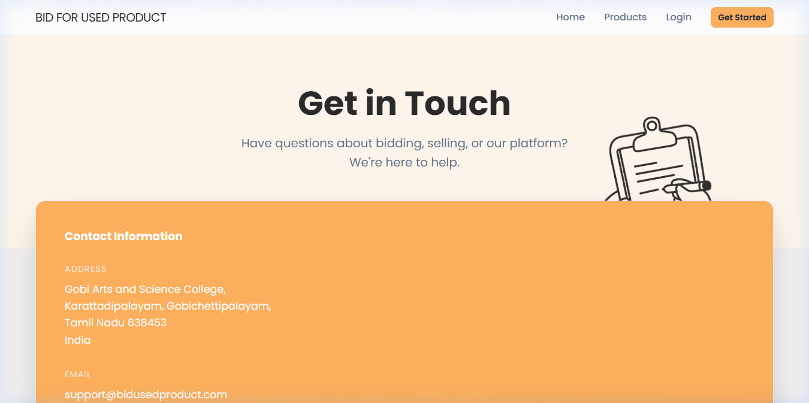

**Description:** The contact page provides a support and inquiry form for any visitor or registered user to communicate with the platform administrators. The form collects the sender's name, email address, subject, and a detailed message body. Submitted messages are stored in the `contact_messages` database table and can be reviewed by the admin through the Messages section of the admin panel. This serves as the primary customer support channel for the platform.

---

#### 07. Terms and Conditions — `pages/terms.php`


**Description:** The Terms and Conditions page outlines the legal agreements governing platform usage. It covers user eligibility requirements, registration obligations, prohibited activities, seller and buyer responsibilities in auction transactions, intellectual property rights, the platform's liability limitations, and the procedures for account termination. All users are required to agree to these terms during the registration process. The page is fully accessible without authentication.

---

#### 08. Privacy Policy — `pages/privacy.php`

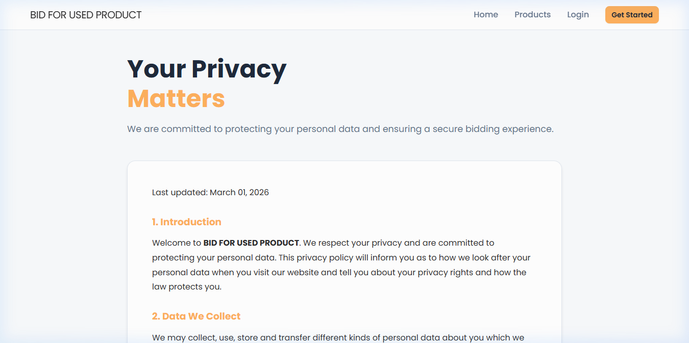

**Description:** The Privacy Policy page documents how the platform collects, stores, uses, and protects user data in compliance with applicable data protection standards. It specifies which personal information is collected during registration (name, email, contact, address, GST details), how data is used for service delivery and notifications, the data retention policy, and user rights regarding their personal information. This page serves as the privacy disclosure document for all platform participants.

---

#### 09. Forgot Password — `pages/forgot_password.php`

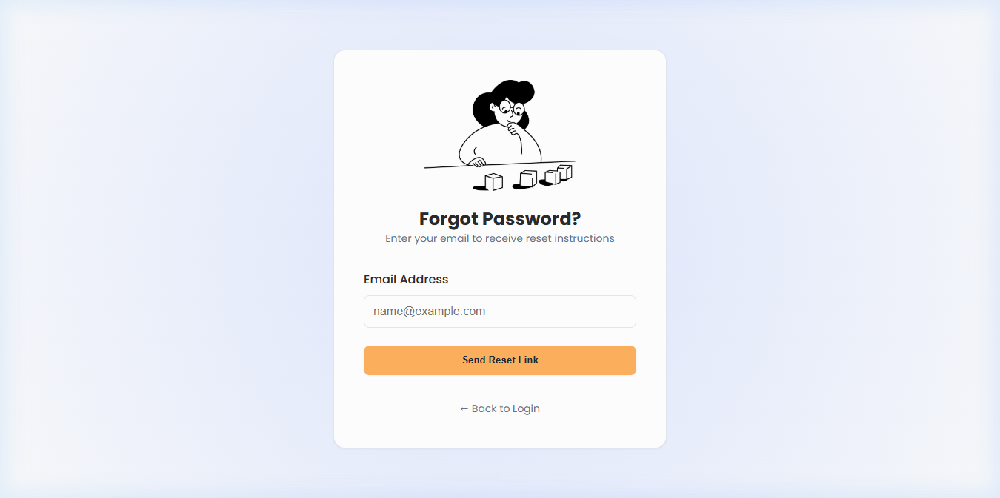

**Description:** The Forgot Password page provides an account recovery mechanism for users who have lost access to their accounts. The form accepts the registered email address and initiates the password reset workflow. This page is accessible without authentication and is linked from the Login page. The form provides clear instructions and feedback messaging to guide users through the recovery process.

---

### A.2 Administrator Pages

> **Login Credentials:** `admin@example.com` / `admin123`

---

#### 10. Admin Dashboard — `admin/dashboard.php`

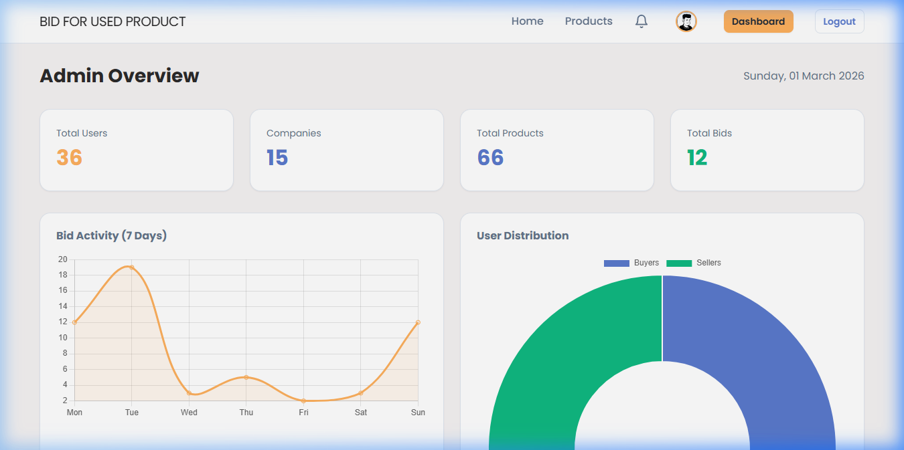

**Description:** The Admin Dashboard is the central command interface for the platform administrator. It displays a summary of key system metrics including total registered users, total company registrations, total products listed, and total bids placed. The dashboard also contains a quick-action panel with shortcuts to User Management, Company Verification, Reports, and System Settings. Recent activity feeds show the latest user registrations, product listings, and bid transactions for real-time platform monitoring.

---

#### 11. Manage Users — `admin/manage_users.php`

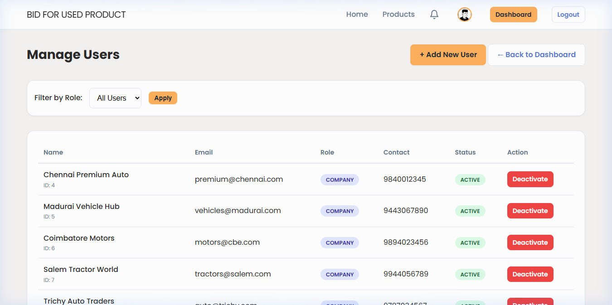

**Description:** The Manage Users page provides the administrator with a full directory of all registered platform users. The table displays each user's name, email address, assigned role (admin, company, client), account status (active, inactive, banned), and registration date. The administrator can toggle user status between active and banned using inline action buttons, enabling platform access control. Search and filter capabilities allow quick lookup of specific users by name, email, or role.

---

#### 12. Verify Companies — `admin/verify_companies.php`

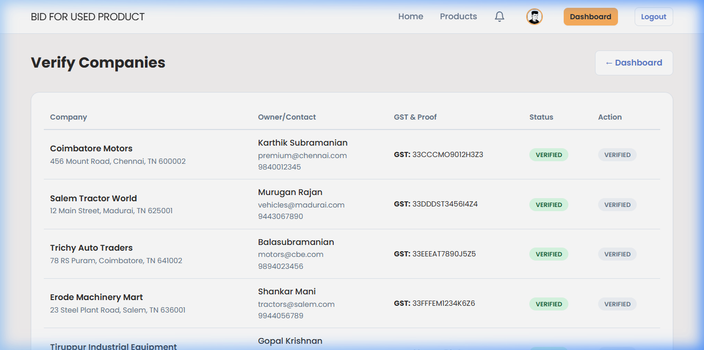

**Description:** The Verify Companies page displays the queue of all registered company (seller) accounts for administrator review. Each entry shows the company name, owner's contact details (email and phone), GST registration number, and current verification status (Pending or Verified). The administrator can approve pending company applications using the "Approve" action button, which updates the company's `verified_status` to `verified` and grants them access to list products on the platform. This GST-based verification step is critical to the platform's seller authentication model.

---

#### 13. View All Products — `admin/view_all_products.php`

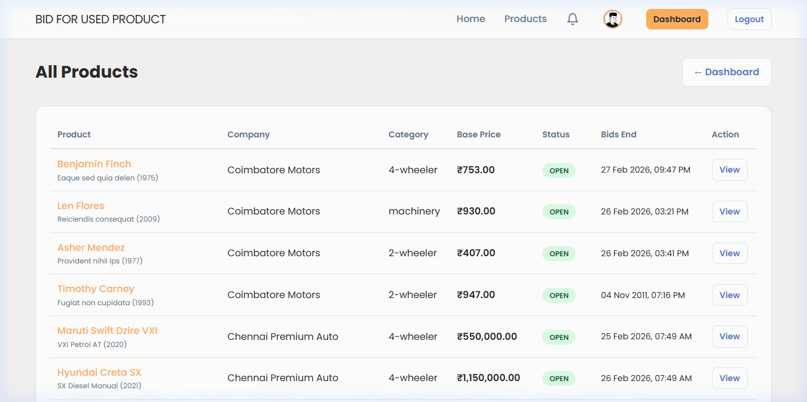

**Description:** The View All Products page gives the administrator a comprehensive, platform-wide view of every product listing regardless of which company posted it. The table shows product name, category, listing company, base price, current auction status (open, closed, sold), auction deadline, and total number of bids received. This page enables administrative oversight of all inventory, allowing the admin to monitor auction health, identify anomalies, and take corrective action on problematic listings through a centralized interface.

---

#### 14. View All Bids — `admin/view_all_bids.php`

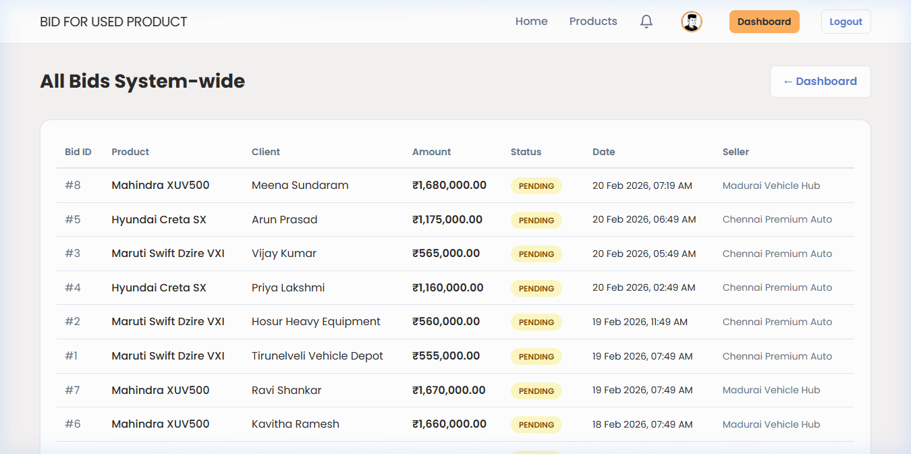

**Description:** The View All Bids page presents a complete ledger of every bid ever submitted on the platform. Each record shows the product name, the bidding client's name and email, the bid amount, bid status (pending, approved, rejected), and the exact timestamp of submission. This provides a full audit trail of all financial offers on the platform, allowing the administrator to track bidding activity, investigate disputes, and monitor the integrity of the competitive bidding engine across all active and completed auctions.

---

#### 15. Reports — `admin/reports.php`

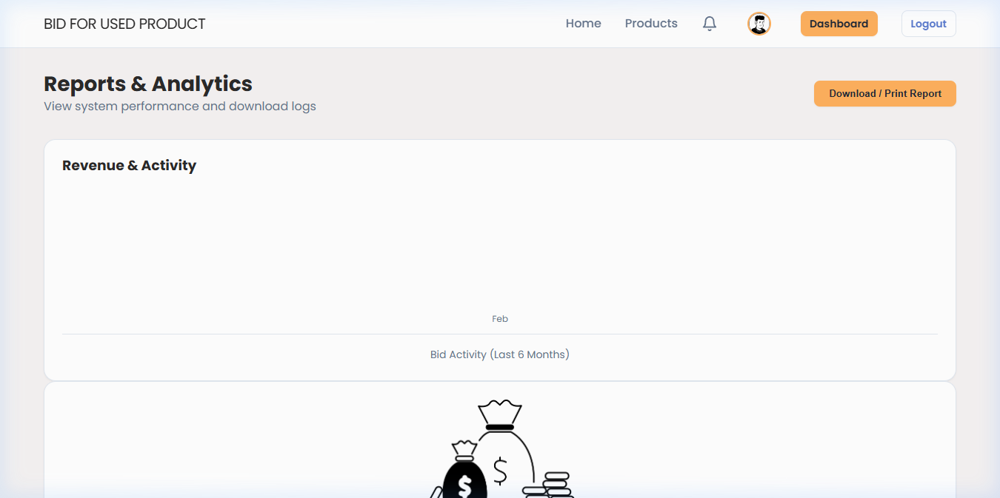

**Description:** The Reports page provides the administrator with a structured analytics dashboard summarizing platform performance metrics. Charts and summary tables present data on total platform revenue (aggregate bid amounts), number of auctions completed, new user registrations over time, company application trends, and bid volume statistics. These analytics support data-driven decision-making for platform governance, marketing improvement, and operational scaling. The reports give a high-level view of platform health and growth trajectory.

---

#### 16. Messages — `admin/messages.php`

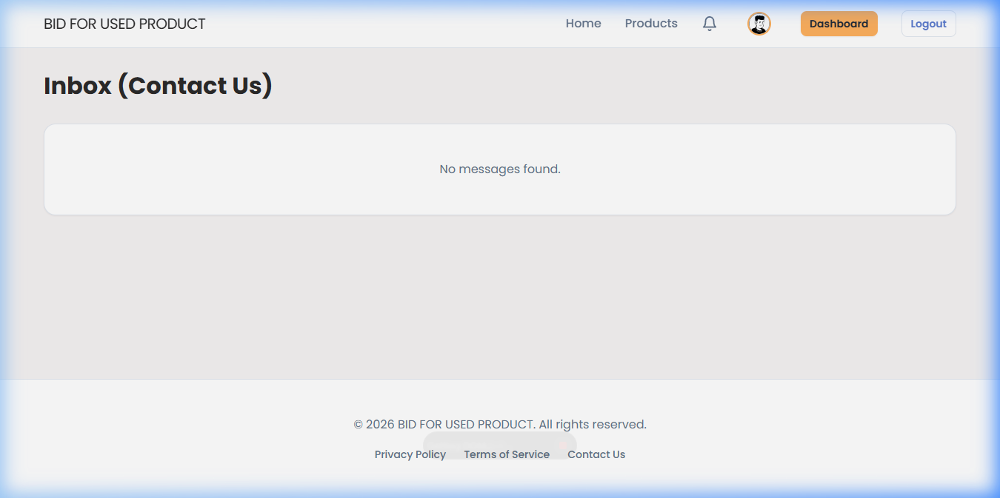

**Description:** The Messages page is the administrator's inbox for all contact form submissions received from the Contact Us page. Each message entry displays the sender's name, email address, subject line, message content preview, and the submission timestamp. The admin can click "View" to read the complete message body. This serves as the primary customer support inbox, allowing the admin team to respond to user inquiries, technical issues, and business feedback received through the platform's public contact channel.

---

#### 17. Settings — `admin/settings.php`

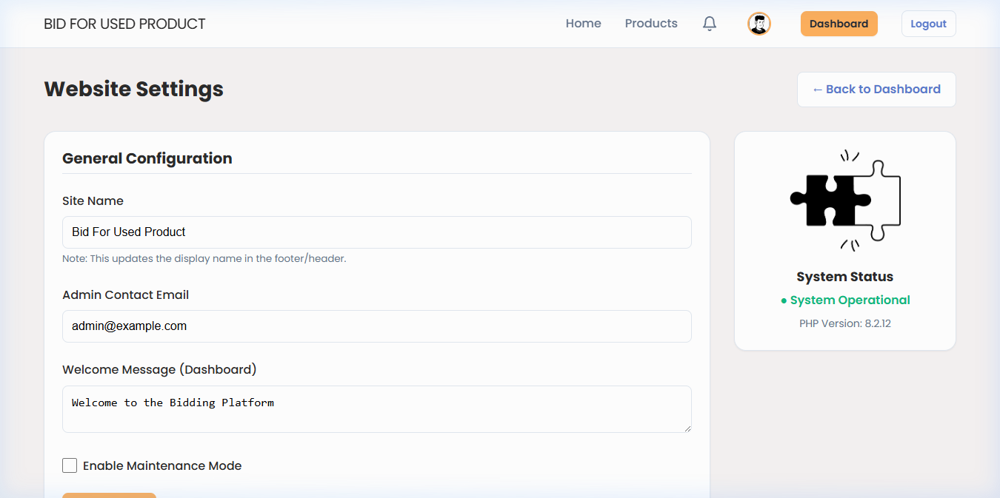

**Description:** The Settings page allows the administrator to configure platform-level operational parameters. Key configurable settings include the Site Name, Maintenance Mode toggle (enables or disables the maintenance screen for all non-admin users), and other system configuration values stored in the `site_settings` table. Changes made here immediately affect platform behavior. The maintenance mode feature is particularly useful for applying database updates or code deployments without disrupting active users.

---

#### 18. System Manager — `admin/system_manager.php`

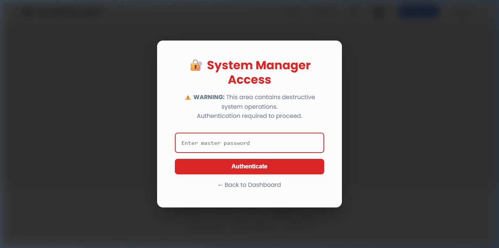

**Description:** The System Manager is an advanced administrative control panel providing deep system-level controls and diagnostics. It displays server environment information (PHP version, MySQL version, server OS), application performance metrics, error log access, cache and session management utilities, and database health indicators. This page is intended for technical administrators to perform maintenance operations, debug system-level issues, and ensure the application infrastructure remains healthy and secure.

---

#### 19. Add User — `admin/add_user.php`

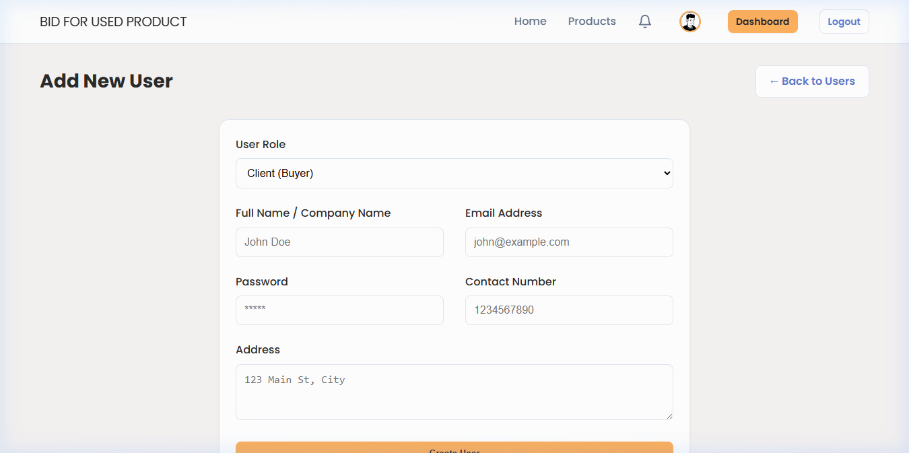

**Description:** The Add User page allows an administrator to create new user accounts directly without requiring the standard public registration workflow. The form accepts name, email, password, role (admin, company, or client), and account status. This tool is used for onboarding specific users (such as additional admin accounts or pre-approved company accounts) without exposing them to the public registration process. Passwords are hashed using bcrypt before storage, maintaining the same security standards as self-registered accounts.

---

### A.3 Company / Seller Pages

> **Login Credentials:** `premium@chennai.com` / `company123`

---

#### 20. Company Dashboard — `company/dashboard.php`

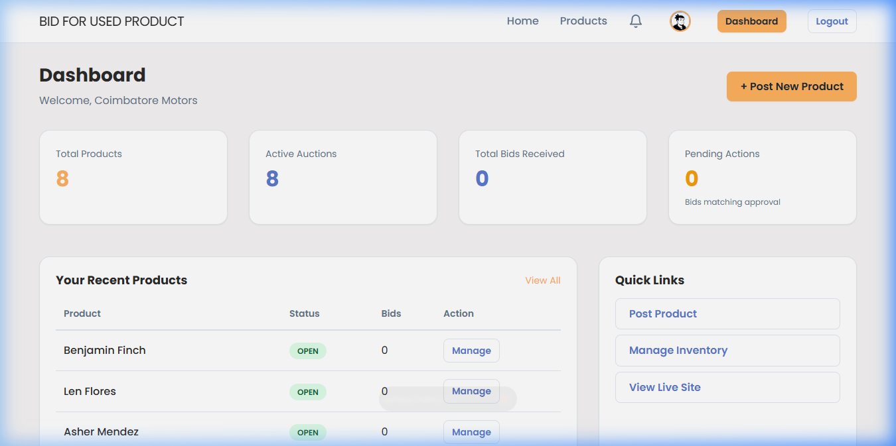

**Description:** The Company Dashboard is the seller's home screen after login, providing an overview of their auction activity. Key metrics displayed include the total number of products currently listed, the number of active bids received across all listings, total closed auctions, and recent bid notifications. Quick-action buttons navigate to Post a New Product, My Products inventory, and View Bids. This dashboard serves as the operational center for sellers to monitor their auction portfolio and respond to buyer activity in real time.

---

#### 21. Post Product — `company/post_product.php`

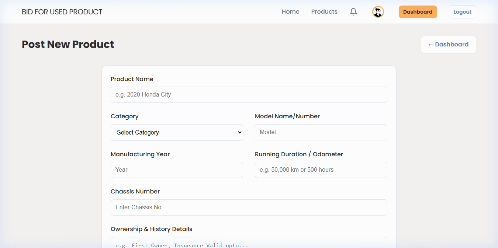

**Description:** The Post Product page is the primary product listing creation interface for verified company sellers. The form collects comprehensive product information including product name, category (Vehicles, Tractors, JCB, Harvesters, etc.), model, manufacturing year, chassis number, owner details, running duration, base auction price, auction start and end dates, main product image upload, and a detailed description. The form includes real-time validation to ensure all required fields are properly filled before submission, with uploaded images stored in the `uploads/` directory.

---

#### 22. My Products — `company/my_products.php`

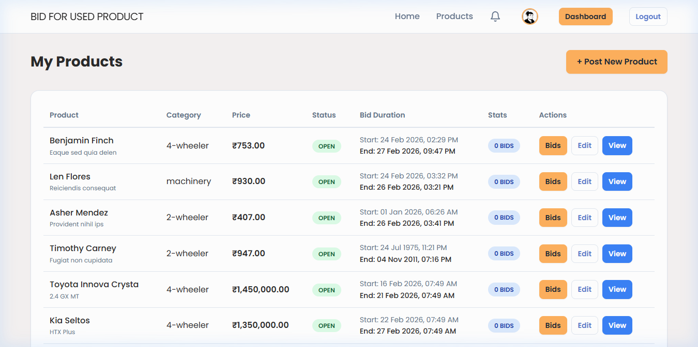

**Description:** The My Products page shows the company's complete inventory of listed auction items. Each product row displays the product name, category, base price, current highest bid amount, auction status (open/closed/sold), auction expiry date, total bids received, and action buttons for editing, viewing bids, or deleting the listing. This page gives sellers a consolidated view of their entire auction portfolio with real-time bid and status data, enabling them to manage multiple listings simultaneously and identify auctions needing attention.

---

#### 23. View Bids — `company/view_bids.php`

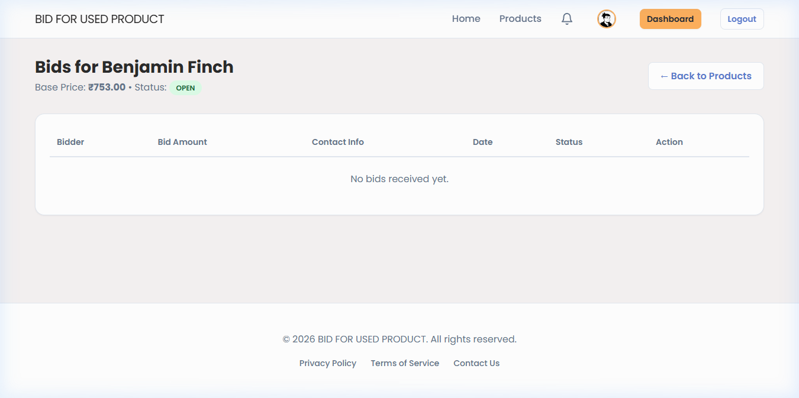

**Description:** The View Bids page provides a detailed breakdown of all bids received for a specific product listing. The table shows each bidder's name, email, bid amount, bid placement time, and current bid status (pending, approved, or rejected). The product details (name, base price, auction deadline) are shown at the top for reference. The seller can approve the winning bid using the "Approve" button, which closes the auction and marks the product as sold, or reject individual bids if necessary.

---

#### 24. Edit Product — `company/edit_product.php`

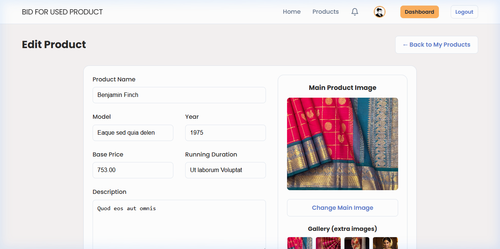

**Description:** The Edit Product page allows a seller to modify the details of an existing product listing. All fields from the original Post Product form are pre-populated with current values and are editable: product name, category, model, year, chassis number, base price, auction dates, description, and product image. This enables sellers to correct errors, update pricing before bids begin, extend auction deadlines, or refresh product information. Changes are validated before saving and take effect immediately on the public product catalog.

---

### A.4 Client / Buyer Pages

> **Login Credentials:** `vijay.k@gmail.com` / `client123`

---

#### 25. Client Dashboard — `client/dashboard.php`

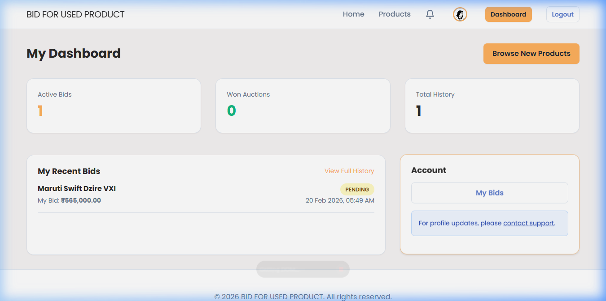

**Description:** The Client Dashboard is the buyer's personalized home screen after login. It summarizes the client's bidding activity including: total bids placed, number of currently winning bids, auctions where the client has been outbid, and completed auctions. Quick-access cards link to Browse Products, My Bids history, and Watchlist. Notification alerts for recent bid status changes (outbid alerts, auction close alerts) are prominently displayed. This dashboard gives buyers a clear snapshot of their auction participation status.

---

#### 26. Browse Products — `client/browse_products.php`

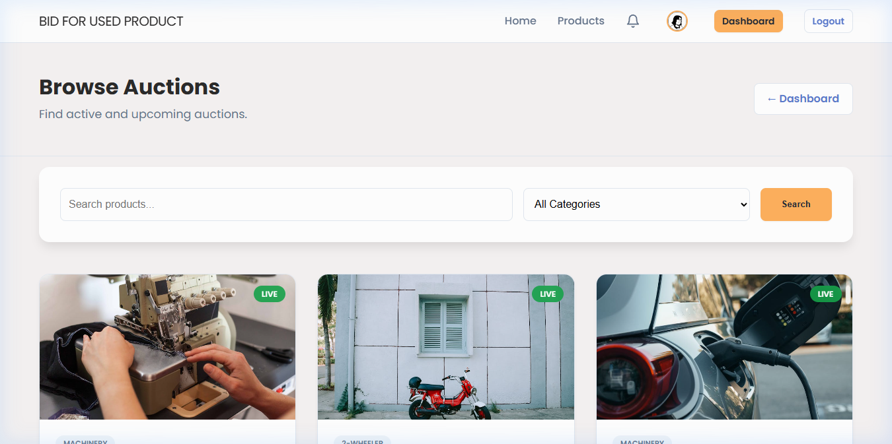

**Description:** The Browse Products page is the buyer-specific product discovery interface with enhanced filtering and interactivity compared to the public catalog. Buyers can filter listings by category, price range, and auction status. Each product card shows the current highest bid, time remaining, and a quick "Place Bid" action button. Authenticated clients can also toggle the Watchlist reminder feature directly from this page. The interface dynamically updates product statuses and bid amounts to give buyers an accurate real-time view of available auctions.

---

#### 27. My Bids — `client/my_bids.php`

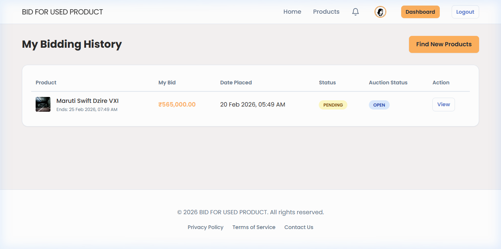

**Description:** The My Bids page displays the complete bidding history for the logged-in client. Each entry shows the product name with a thumbnail, the bid amount the client submitted, the current highest bid on that product, bid status (Pending, Winning, Outbid, or Auction Closed), and the auction deadline. Color-coded status badges make it easy for buyers to quickly identify which auctions they are currently winning versus those where they have been outbid, providing actionable insight to place updated competitive bids.

---

### A.5 Shared Pages

> Accessible to all authenticated users regardless of role.

---

#### 28. User Profile — `profile.php`

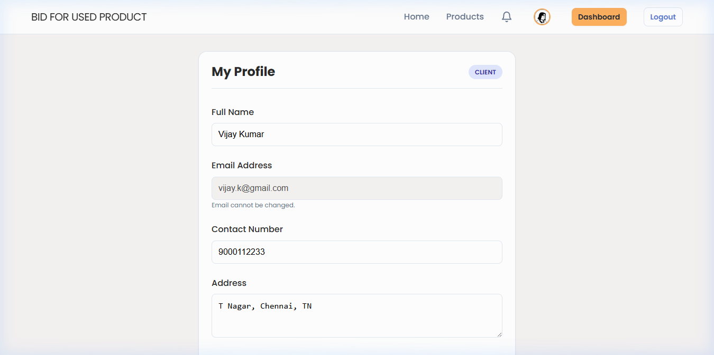

**Description:** The User Profile page provides all authenticated users (admin, company, and client) with an account management interface. Users can update their personal information including full name, email address, phone number, and physical address. A dedicated password change section requires entering the current password before accepting a new one, providing an additional security layer. Profile data changes are validated and saved to the `users` table. The page is role-neutral and serves as the common account settings panel across all user types.

---

#### 29. Notifications — `notifications.php`

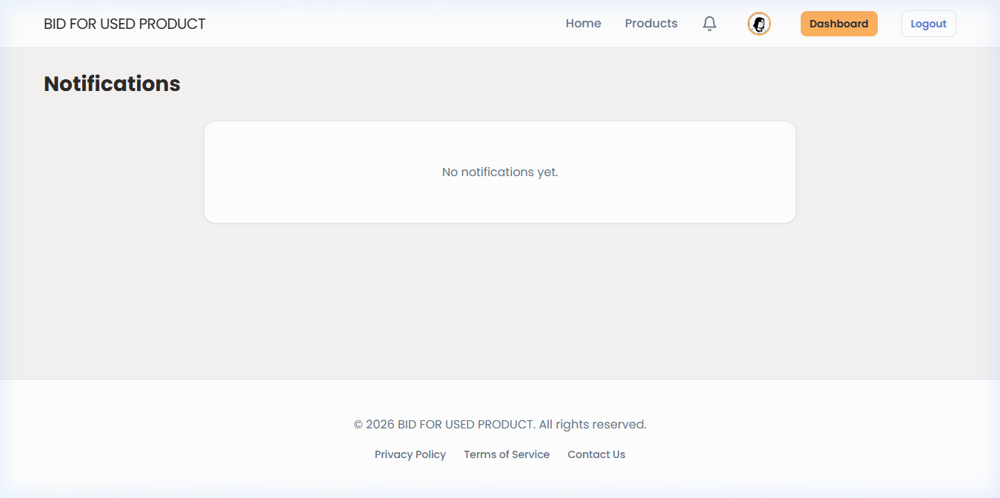

**Description:** The Notifications page is the centralized alert center for all platform events relevant to the logged-in user. For clients, notifications include alerts for being outbid, winning an auction, or receiving admin announcements. For companies, notifications report new bids received on listings. Each notification entry shows the event type, message content, target link (to the related product or action), and timestamp. Unread notifications are visually highlighted, and a "Mark All Read" function clears the notification badge from the main navigation header.

---

## Appendix B — Screenshot Index

| # | Page Name | Section | Viewport File | Full File |
|:---|:---|:---|:---|:---|
| 01 | Homepage | Public | `01_home_viewport.png` | `01_home_full.png` |
| 02 | Products Catalog | Public | `02_products_viewport.png` | `02_products_full.png` |
| 03 | Login | Public | `03_login_viewport.png` | `03_login_full.png` |
| 04 | Register Client | Public | `04_register_client_viewport.png` | `04_register_client_full.png` |
| 05 | Register Company | Public | `05_register_company_viewport.png` | `05_register_company_full.png` |
| 06 | Contact | Public | `06_contact_viewport.png` | `06_contact_full.png` |
| 07 | Terms | Public | `07_terms_viewport.png` | `07_terms_full.png` |
| 08 | Privacy | Public | `08_privacy_viewport.png` | `08_privacy_full.png` |
| 09 | Forgot Password | Public | `09_forgot_password_viewport.png` | `09_forgot_password_full.png` |
| 10 | Admin Dashboard | Admin | `10_admin_dashboard_viewport.png` | `10_admin_dashboard_full.png` |
| 11 | Manage Users | Admin | `11_admin_manage_users_viewport.png` | `11_admin_manage_users_full.png` |
| 12 | Verify Companies | Admin | `12_admin_verify_companies_viewport.png` | `12_admin_verify_companies_full.png` |
| 13 | View All Products | Admin | `13_admin_view_products_viewport.png` | `13_admin_view_products_full.png` |
| 14 | View All Bids | Admin | `14_admin_view_bids_viewport.png` | `14_admin_view_bids_full.png` |
| 15 | Reports | Admin | `15_admin_reports_viewport.png` | `15_admin_reports_full.png` |
| 16 | Messages | Admin | `16_admin_messages_viewport.png` | `16_admin_messages_full.png` |
| 17 | Settings | Admin | `17_admin_settings_viewport.png` | `17_admin_settings_full.png` |
| 18 | System Manager | Admin | `18_admin_system_manager_viewport.png` | `18_admin_system_manager_full.png` |
| 19 | Add User | Admin | `19_admin_add_user_viewport.png` | `19_admin_add_user_full.png` |
| 20 | Company Dashboard | Company | `20_company_dashboard_viewport.png` | `20_company_dashboard_full.png` |
| 21 | Post Product | Company | `21_company_post_product_viewport.png` | `21_company_post_product_full.png` |
| 22 | My Products | Company | `22_company_my_products_viewport.png` | `22_company_my_products_full.png` |
| 23 | View Bids | Company | `23_company_view_bids_viewport.png` | `23_company_view_bids_full.png` |
| 24 | Edit Product | Company | `24_company_edit_product_viewport.png` | `24_company_edit_product_full.png` |
| 25 | Client Dashboard | Client | `25_client_dashboard_viewport.png` | `25_client_dashboard_full.png` |
| 26 | Browse Products | Client | `26_client_browse_products_viewport.png` | `26_client_browse_products_full.png` |
| 27 | My Bids | Client | `27_client_my_bids_viewport.png` | `27_client_my_bids_full.png` |
| 28 | Profile | Shared | `28_profile_viewport.png` | `28_profile_full.png` |
| 29 | Notifications | Shared | `29_notifications_viewport.png` | `29_notifications_full.png` |

---

**Copyright © 2026 iBOY Innovation HUB | Jaiganesh D.**  
*All rights reserved. This report is intended for academic and documentation purposes.*

