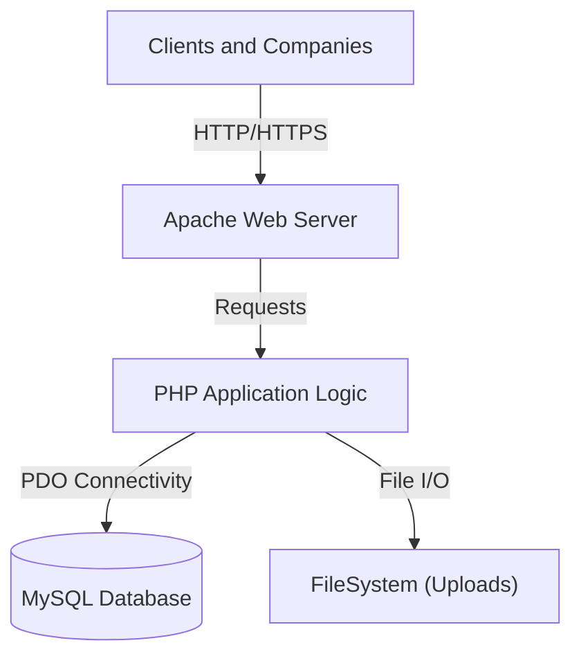
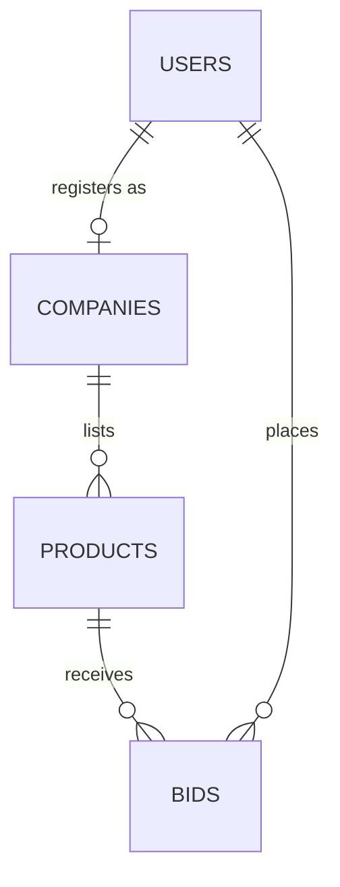

# BID FOR USED PRODUCT - Comprehensive Technical Documentation

**Version**: 2.0.0 (Enterprise Edition)
**Region Focus**: Tamil Nadu, India
**Domain**: Auction and Bidding System for Vehicles and Machinery

---

> [!IMPORTANT]
> **Academic and Technical Report Available**: For a detailed multi-dimensional feasibility study, database dictionary, and high-level architecture analysis, please refer to the [COMPLETE_PROJECT_REPORT.md](COMPLETE_PROJECT_REPORT.md).

---

## Developer Profile

**Jaiganesh D. (iBOY)**
Founder of **iBOY Innovation HUB**

*   **Company**: iBOY Innovation HUB
*   **Official Email**: iboy.innovationhub@gmail.com
*   **GitHub Profile**: [github.com/iBOYJAI](https://github.com/iBOYJAI/)

### Professional Bio
Jaiganesh D. (iBOY) is the Founder of iBOY Innovation HUB, a technology startup focused on building AI-powered SaaS platforms, automation tools, and future-ready digital solutions. He specializes in Full-Stack Development, Artificial Intelligence integration, backend systems, and scalable startup architecture.

Through iBOY Innovation HUB, he is developing innovative platforms such as AI-based tools, legal tech solutions, automation systems, and modern web applications designed to solve real-world problems. His mission is to create impactful, scalable, and intelligent products that empower businesses and individuals.

---

## 1. Project Overview

**Bid For Used Product** is a production-ready web-based auction marketplace designed to facilitate the secure and transparent buying and selling of used vehicles (Cars, Bikes) and Heavy Machinery. The platform connects verified **Companies (Sellers)** with verified **Clients (Buyers)** in a real-time bidding environment.

### Key Objectives
*   **Transparency**: Elimination of traditional middlemen through a direct-to-buyer bidding engine.
*   **Verification**: Mandatory GST and business identity verification for all listing entities.
*   **Real-time Analytics**: Live monitoring of bidding activities and automated status transitions.
*   **Market Localization**: Specialized inventory categories optimized for the industrial and agricultural sectors in Tamil Nadu.

---

## 2. Core Operational Modules

### 2.1 Administrator Module
The administrative interface provides comprehensive oversight of the entire ecosystem.
*   **User Governance**: Management of user states (active, suspended, or prohibited).
*   **Verification Engine**: Centralized queue for reviewing and approving GST certifications of new companies.
*   **Inventory Oversight**: Global visibility of all products and active bidding history.
*   **System Analytics**: Aggregated reporting on platform activity and transaction volumes.

### 2.2 Seller Module (Company)
Allows verified businesses to reach a broader market through structured auctions.
*   **Listing Management**: Unified dashboard to upload product specifications, images, and auction parameters.
*   **Auction Controls**: Ability to define base prices and auction durations.
*   **Bid Evaluation**: Interface to review all submitted offers and declare authorized winners.

### 2.3 Buyer Module (Client)
Provides a secure environment for participating in real-time auctions.
*   **Product Discovery**: Advanced filtering by category, model year, and price.
*   **Transaction Participation**: Real-time bidding interface with automated validation against current market maximums.
*   **Engagement Tracking**: Personalized dashboard to monitor active bids, watchlist items, and winning history.

---

## 3. Technical Implementation Details

### 3.1 Security Protocols
The application implements several layers of security to ensure data integrity and user protection.
*   **Database Security**: Implementation of PDO Prepared Statements as a primary defense against SQL Injection.
*   **Cryptographic Standards**: Use of the Bcrypt hashing algorithm for secure password storage and verification.
*   **Output Sanitization**: Systematic use of `htmlspecialchars()` to mitigate Cross-Site Scripting (XSS) risks.
*   **Session Management**: Secure session handling with periodic regeneration to prevent hijacking and fixation attacks.

### 3.2 System Architecture
The application utilizes a modular LAMP/WAMP stack architecture.


### 3.3 Relational Logic (ER Diagram)


---

## 4. Hardware and Software Specifications

### 4.1 Development Environment Target
*   **Operating System**: Linux (Ubuntu 22.04 LTS recommended) or Windows (via XAMPP).
*   **Primary Engine**: PHP 8.2 or higher.
*   **Relational Database**: MariaDB 10.4 or MySQL 5.7+.
*   **Web Server**: Apache 2.4 with `mod_rewrite` enabled.

### 4.2 Client Prerequisites
*   **Standard Browsers**: Latest versions of Chrome, Firefox, or Safari.
*   **Scripting**: JavaScript must be enabled for real-time bid validation.

---

## 5. File System Organization

```text
bid_for_used_product/
├── COMPLETE_PROJECT_REPORT.md  # Formal engineering documentation
├── config.php                  # Central environment configuration
├── database/                   # Relational schema definitions
├── includes/                   # Core application classes and shared logic
├── admin/                      # Administrative governance module
├── company/                    # Seller management interface
├── client/                     # Buyer participation module
├── assets/                     # Front-end design and design system
└── uploads/                    # Secure storage for product media
```

---

## 6. Deployment and Configuration

1.  **Repository Deployment**: Clone the source code into the web server root.
2.  **Environment Configuration**: Adjust the `config.php` file to reflect local database credentials.
3.  **Schema Initialization**: Import the SQL definitions provided in the `database/` directory.
4.  **Directory Permissions**: Ensure the `uploads/` directory has appropriate write permissions for the web server process.

---

## 7. Software Licensing

<div align="center">
  <h3>Software Licensing</h3>
  <p>This project is licensed under the <b>MIT License</b>. Specific technical and legal provisions are documented in the <a href="LICENSE">LICENSE</a> file.</p>
  <br />
  <p><b>Developed by iBOY Innovation HUB</b></p>
  <p><i>Innovation is not just what you do — it is who YOU are.</i></p>
</div>

---

**Copyright 2026 Bid For Used Product. Developed for the Tamil Nadu Market.**
