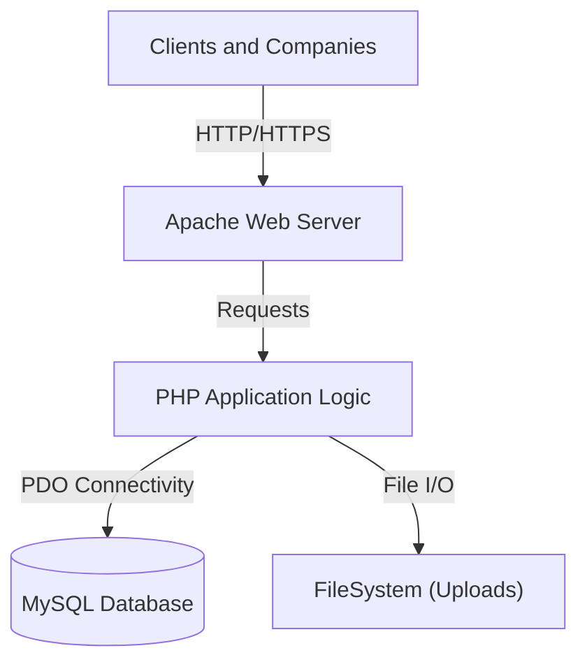
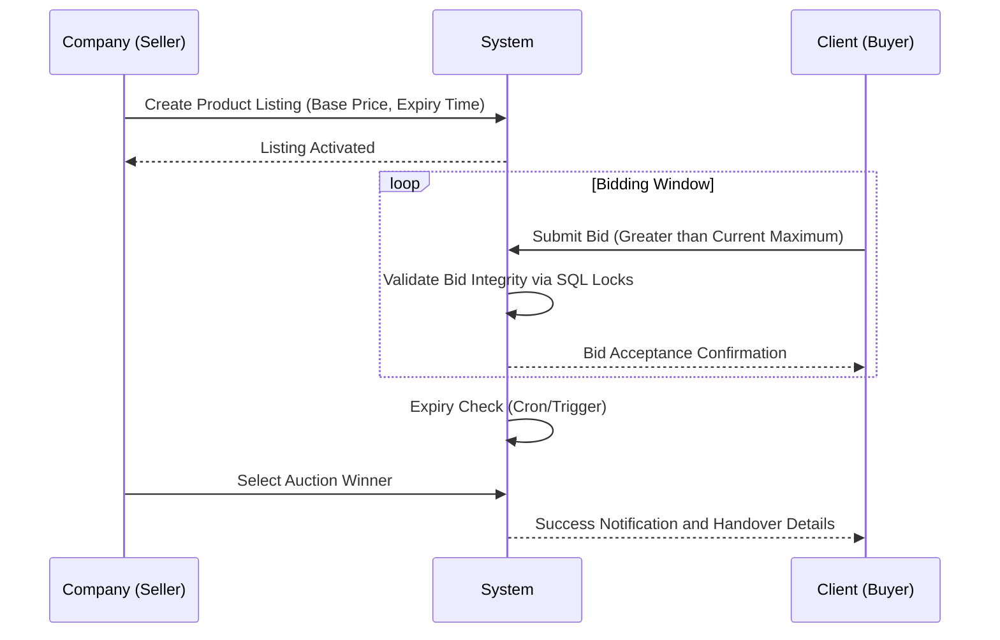
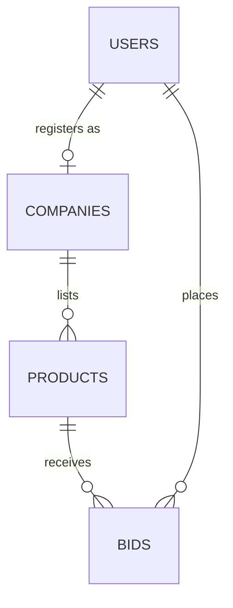
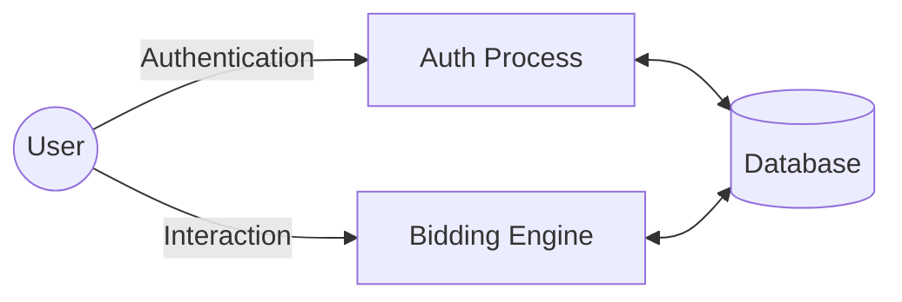

# BID FOR USED PRODUCT - Comprehensive Technical Documentation

**Version**: 2.0.0 (Enterprise Edition)
**Region Focus**: Tamil Nadu, India
**Domain**: Auction and Bidding System for Vehicles and Machinery

---

> [!IMPORTANT]
> **Academic and Technical Report Available**: For a detailed multi-dimensional feasibility study, database dictionary, and high-level architecture analysis, please refer to the [COMPLETE_PROJECT_REPORT.md](COMPLETE_PROJECT_REPORT.md).

---

## Developer Profile

**Jaiganesh D. (iBOY)**
Founder of **iBOY Innovation HUB**

*   **Company**: iBOY Innovation HUB
*   **Official Email**: iboy.innovationhub@gmail.com
*   **GitHub Profile**: [github.com/iBOYJAI](https://github.com/iBOYJAI/)

### Professional Bio
Jaiganesh D. (iBOY) is the Founder of iBOY Innovation HUB, a technology startup focused on building AI-powered SaaS platforms, automation tools, and future-ready digital solutions. He specializes in Full-Stack Development, Artificial Intelligence integration, backend systems, and scalable startup architecture.

Through iBOY Innovation HUB, he is developing innovative platforms such as AI-based tools, legal tech solutions, automation systems, and modern web applications designed to solve real-world problems. His mission is to create impactful, scalable, and intelligent products that empower businesses and individuals.

---

## 1. Project Overview

**Bid For Used Product** is a production-ready web-based auction marketplace designed to facilitate the secure and transparent buying and selling of used vehicles (Cars, Bikes) and Heavy Machinery. The platform connects verified **Companies (Sellers)** with verified **Clients (Buyers)** in a real-time bidding environment.

### Key Objectives
*   **Transparency**: Eliminate middlemen by connecting owners directly with bidders through an open bidding system.
*   **Security**: Ensure all sellers must undergo GST verification before listing any inventory.
*   **Real-time Interaction**: Implementation of live bidding status updates and automated notifications for all stakeholders.
*   **Regional Specialization**: Tailored categories for agricultural and industrial equipment common in the Tamil Nadu market.

---

## 2. Technical Diagrams

### System Architecture
The application utilizes a modular LAMP/WAMP stack architecture, emphasizing performance and security through native PHP implementation.



### User Flow (Sequence Diagram)
The following diagram illustrates the interaction between sellers, the system, and potential buyers during an active auction.



### Entity Relationship (ER) Diagram
Detailed relational mapping between core system entities.



### Data Flow Diagram (DFD) - Level 1
High-level data movement within the application modules.



---

## 3. Project Structure and System Files

The codebase is organized into discrete modules to facilitate maintenance and scalability.

```text
bid_for_used_product/
├── COMPLETE_PROJECT_REPORT.md  # Comprehensive academic and technical documentation
├── config.php                  # Global configuration and environment settings
├── debug_db.php                # Database diagnostic and troubleshooting utility
├── index.php                   # Primary entry point and landing page
├── logout.php                  # Session termination and cleanup
├── patch_sport_icons.php        # UI asset management script
├── README.md                   # Technical overview (This document)
├── setup.bat                   # Environment initialization script
├── admin/                      # Administrative control module
├── api/                        # REST-compliant backend API endpoints
├── assets/                     # Frontend assets (Static CSS, JS, Images)
├── database/                   # SQL schema and migration scripts
├── docs/                       # Supplemental technical documentation
├── technical/                  # Engineering logs and system analysis
├── user/                       # Shared user interface components
├── includes/                   # Reusable PHP partials and core classes
└── staff/                      # Internal management and support tools
```

---

## 4. Software Licensing

<div align="center">
  <h3>Software Licensing</h3>
  <p>This project is licensed under the <b>MIT License</b>. Full technical and legal provisions are documented in the <a href="LICENSE">LICENSE</a> file.</p>
  <br />
  <p><b>Developed by iBOY Innovation HUB</b></p>
  <p><i>Innovation is not just what you do — it is who YOU are.</i></p>
</div>

---

**Copyright 2026 Bid For Used Product. Developed for the Tamil Nadu Market.**
