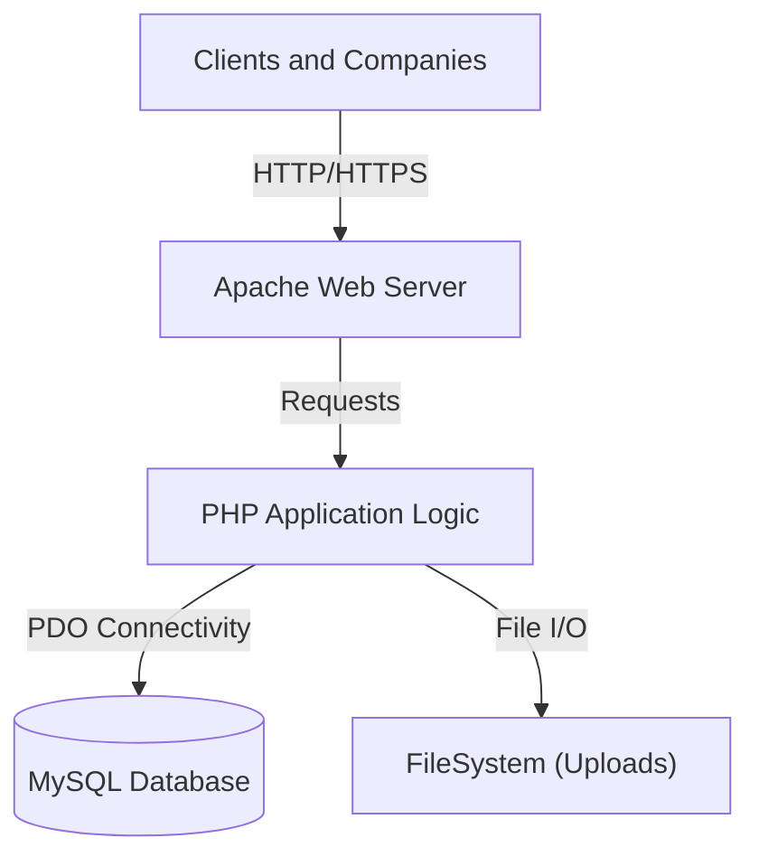
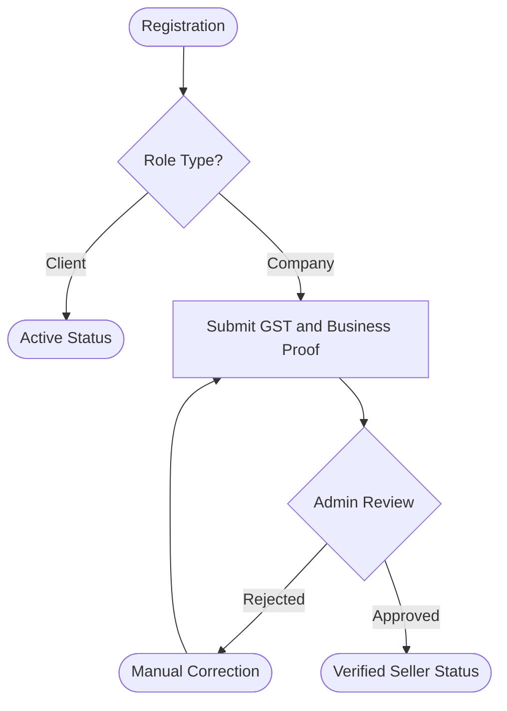
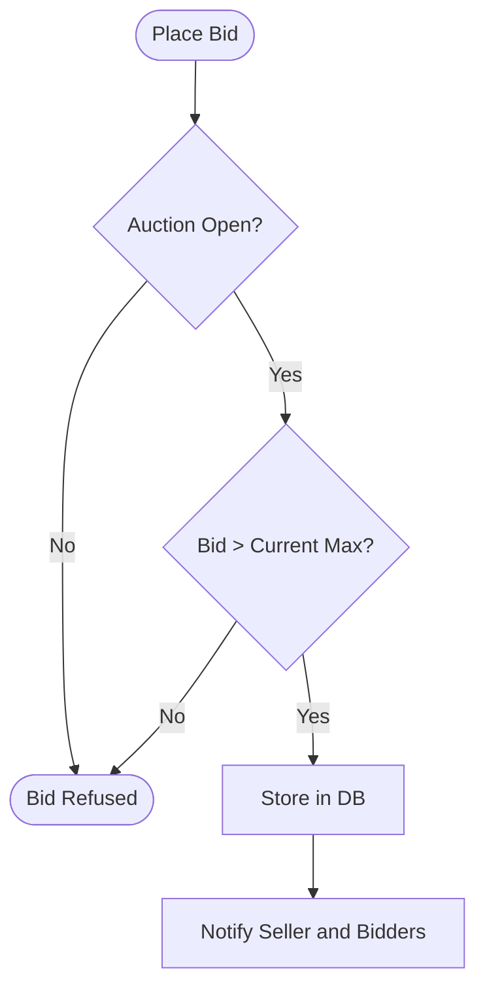

# BID FOR USED PRODUCT - Comprehensive Technical Documentation

**Version**: 2.0.0 (Enterprise Edition)
**Region Focus**: Tamil Nadu, India
**Domain**: Auction and Bidding System for Vehicles and Machinery

---

> [!IMPORTANT]
> **Academic and Technical Report Available**: For a detailed multi-dimensional feasibility study, database dictionary, and high-level architecture analysis, please refer to the [COMPLETE_PROJECT_REPORT.md](COMPLETE_PROJECT_REPORT.md).

---

## Developer Profile

**Jaiganesh D. (iBOY)**
Founder of **iBOY Innovation HUB**

*   **Company**: iBOY Innovation HUB
*   **Official Email**: iboy.innovationhub@gmail.com
*   **GitHub Profile**: [github.com/iBOYJAI](https://github.com/iBOYJAI/)

### Professional Bio
Jaiganesh D. (iBOY) is the Founder of iBOY Innovation HUB, a technology startup focused on building AI-powered SaaS platforms, automation tools, and future-ready digital solutions. He specializes in Full-Stack Development, Artificial Intelligence integration, backend systems, and scalable startup architecture.

Through iBOY Innovation HUB, he is developing innovative platforms such as AI-based tools, legal tech solutions, automation systems, and modern web applications designed to solve real-world problems. His mission is to create impactful, scalable, and intelligent products that empower businesses and individuals.

---

## 1. Project Overview

**Bid For Used Product** is a production-ready web-based auction marketplace designed to facilitate the secure and transparent buying and selling of used vehicles (Cars, Bikes) and Heavy Machinery. The platform connects verified **Companies (Sellers)** with verified **Clients (Buyers)** in a real-time bidding environment.

### 1.1 Technology Stack
| Layer | Technology | Version | Purpose |
| :--- | :--- | :--- | :--- |
| **Backend** | PHP | 8.2+ | Server-side logic and API implementation. |
| **Database** | MySQL | 5.7+ | Relational data persistence and ACID transactions. |
| **Frontend** | HTML5 / CSS3 | Latest | Responsive layout and UI components. |
| **Scripting** | JavaScript | ES6+ | Real-time DOM updates and AJAX communication. |
| **Server** | Apache | 2.4+ | Request routing and static asset delivery. |

---

## 2. Core Operational Modules

### 2.1 Administrator Module
*   **User Governance**: Management of user states (active, suspended, or prohibited).
*   **Verification Engine**: Queue for reviewing and approving GST certifications.
*   **System Analytics**: Reporting on platform activity and transaction volumes.

### 2.2 Seller Module (Company)
*   **Listing Management**: Form-based inventory uploads with multi-image support.
*   **Auction Controls**: Definition of base prices and temporal auction boundaries.
*   **Winner Selection**: Interface to finalize transactions with the highest verified bidder.

### 2.3 Buyer Module (Client)
*   **Product Discovery**: Category-based search and filtering.
*   **Live Bidding**: Interactive interface for submitting validated offers.
*   **Bid Management**: Historical tracking of participated auctions and winning status.

---

## 3. Technical Visualizations

### 3.1 System Architecture

### 3.2 User Verification Flow

### 3.3 Bidding Logic Flow

---

## 4. System Governance (RBAC Matrix)

| Feature / Action | Administrator | Verified Company | Client | Guest |
| :--- | :---: | :---: | :---: | :---: |
| **View Catalog** | Read | Read | Read | Read |
| **Register** | N/A | N/A | N/A | Create |
| **Place Bid** | No | No | Yes | No |
| **List Product** | No | Yes | No | No |
| **Approve Seller** | Yes | No | No | No |
| **Ban User** | Yes | No | No | No |
| **Manage Content** | Full | Partial | No | No |

---

## 5. Comprehensive Site Inventory (Sitemap)

| Group | Page Name | Primary Function | Access Level |
| :--- | :--- | :--- | :--- |
| **Public** | `index.php` | Homepage and active auction preview. | All |
| **Public** | `product_details.php` | Technical specifications and high-res images. | All |
| **Admin** | `admin/verify_companies.php` | GST and business document verification. | Admin |
| **Admin** | `admin/manage_users.php` | User status and permissions management. | Admin |
| **Seller** | `company/add_product.php` | Inventory listing entry point. | Company |
| **Seller** | `company/view_bids.php` | Real-time bid analysis for owned listings. | Company |
| **Buyer** | `client/my_bids.php` | Historical and active bidding activity. | Client |
| **Buyer** | `client/watchlist.php` | Saved items and auction reminders. | Client |

---

## 6. Security and Deployment

### 6.1 Security Protocols
*   **Data Integrity**: Systematic use of PDO Prepared Statements.
*   **Authentication**: Bcrypt hashing for credential security.
*   **Protection**: HTML sanitization and session regeneration.

### 6.2 Implementation Steps
1.  **Deployment**: Clone source to web root.
2.  **Configuration**: Define database parameters in `config.php`.
3.  **Database**: Execute SQL initialization from the `database/` folder.
4.  **Permissions**: Verify write access for the `uploads/` directory.

---

## 7. Software Licensing

  <h3>Software Licensing</h3>
  
This project is licensed under the <b>MIT License</b>. Full legal provisions are documented in the <a href="LICENSE">LICENSE</a> file.

   
  
<b>Developed by iBOY Innovation HUB</b>

  
<i>Innovation is not just what you do — it is who YOU are.</i>

---
