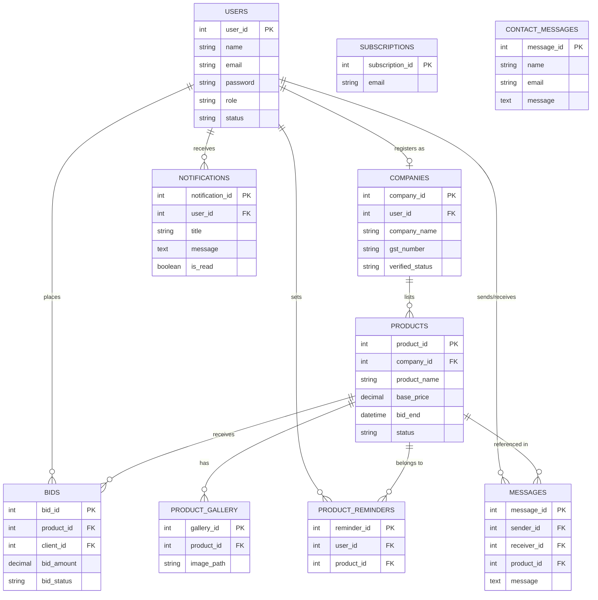
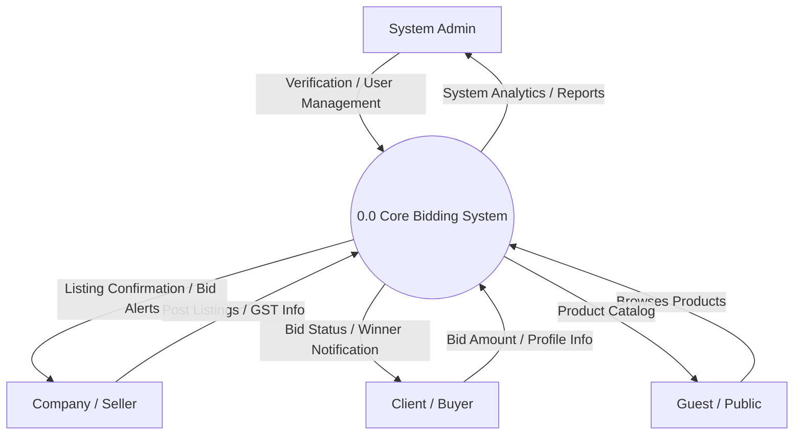
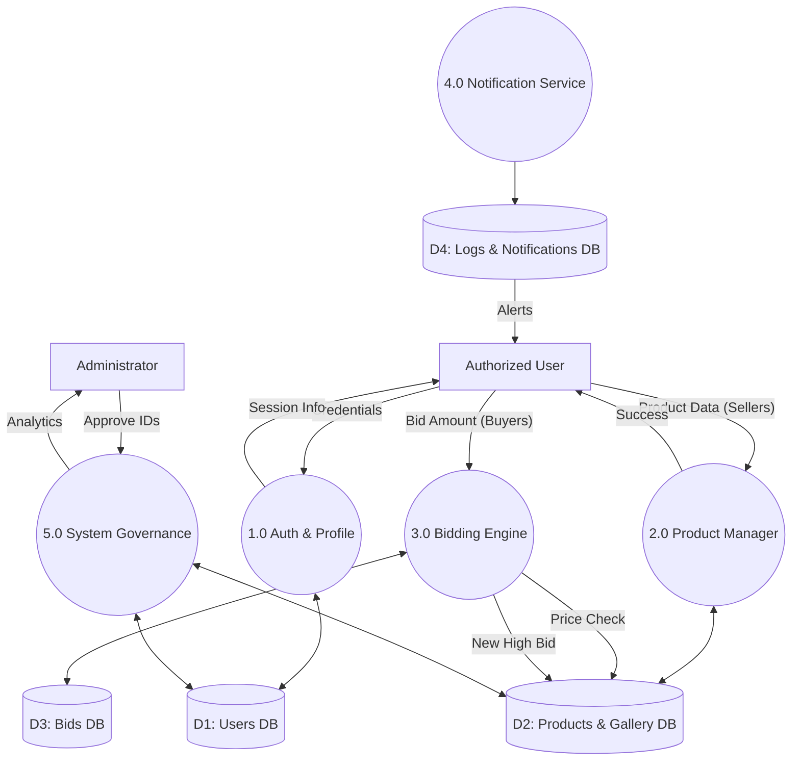
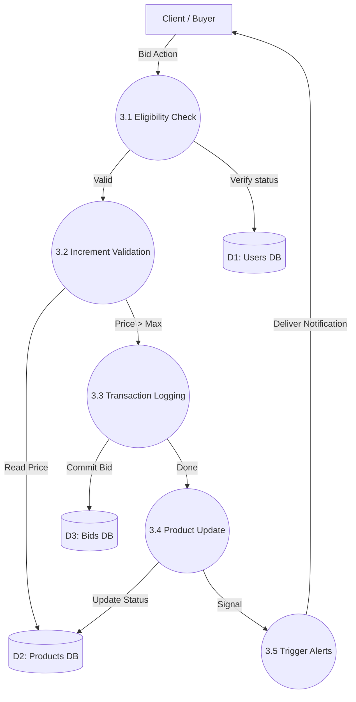
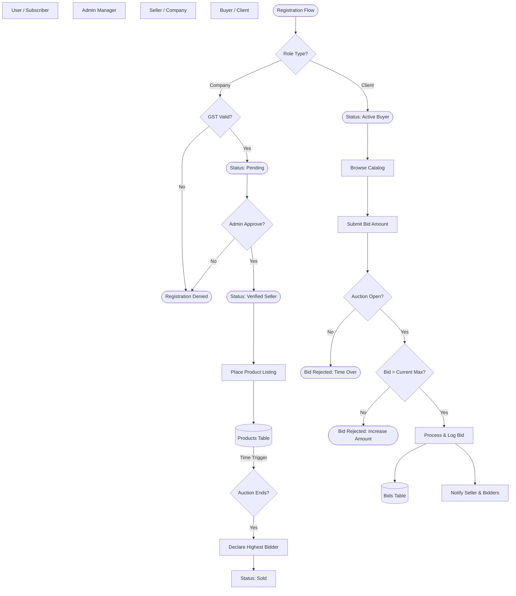

# 📊 Bid For Used Product - DFD & ER Analysis

This document provides a comprehensive breakdown of the **Data Flow Diagrams (DFDs)** at multiple levels and illustrates how the **Entity Relationship (ER)** diagram integrates with the system logic.

---

## 🔧 1. Entity Relationship (ER) Diagram
### Title: Entity Relationship Diagram (ERD) for Database Architecture
The ER diagram uses standard **Crow's Foot Notation** to define the relationship between database tables (Data Stores).

---

## 🌐 2. DFD Level 0: Context Diagram
### Title: DFD Level 0 - System Context Diagram
Following standard DFD notation: **Rectangles** are External Entities, and **Circles** are the System Process.

---

## 📂 3. DFD Level 1: System Overview
### Title: DFD Level 1 - Major System Processes & Data Flow
Processes are represented as **Circles**, External Entities as **Rectangles**, and Data Stores as **Cylinders/Database Icons**.

---

## 🔬 4. DFD Level 2: Bidding Process Detail
### Title: DFD Level 2 - Detailed Data Flow for Bidding Engine
This expanded view uses the same academic shapes for consistency.

---

## 🎓 5. Understanding the Bridge: ER to DFD
The connection between the static data (ER) and moving data (DFD):

1.  **ER Diagram (Attributes)**: Defines exact fields like `bid_amount`.
2.  **DFD (Flows)**: Shows how `bid_amount` moves from a **Client** into the **Bidding Engine** and finally sits in the **Bids DB**.

---

## 🔧 6. ER Logic Flow Diagram (Conditions & Logic)
### Title: System Logical Flow with ER Integration & Decision Points
This diagram illustrates the **Conditional Logic** within the system, showing how entities interact based on specific business rules and database states.

### Logical Conditions & Controls:
1.  **Verification Condition**: Companies must provide a valid GST; otherwise, they are trapped in the `Rejected` state.
2.  **Temporal Constraint**: The `TimeCheck` logic reads the `bid_end` attribute from the **Products** entity.
3.  **Financial Constraint**: The `ValBid` logic compares the input against the `MAX(bid_amount)` in the **Bids** entity.
4.  **Relational Constraint**: Bids can only be processed if the `user_id` is linked to an `active` status in the **Users** entity.

---
**Document Status**: Final Version (Updated Shapes & Logic) | **Project**: Bid For Used Product
